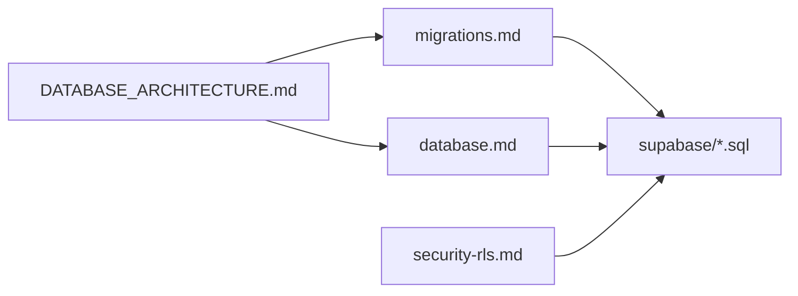
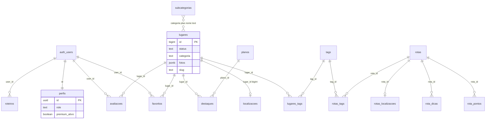

# Database architecture — Guia de Bolso

Canonical document for **modeling, normalization, integrity, performance, scalability**, and **evolution roadmap**. For column-level reference and query patterns, see [Database reference](./database.md). For apply order and migration practices, see [Migrations](./migrations.md).

> **Handoff:** [docs/README.md](./README.md) · [data-flows.md](./data-flows.md) · [authentication.md](./authentication.md)

| Property | Value |
|----------|--------|
| Engine | PostgreSQL 15 (Supabase) |
| Region | `us-west-2` |
| Project ref | `rsdjbqzjdyeaedyqwrvc` |
| Auth schema | `auth.users` (managed by Supabase) |
| App schema | `public` |
| Change delivery | Manual SQL Editor + versioned files in [`/supabase`](../supabase/) |

---

## 1. Vision and principles

1. **RLS by default** — Every `public` table exposed to PostgREST must have policies aligned with [`security-rls.md`](./security-rls.md).
2. **Hybrid schema source** — Base tables were created in the Supabase Dashboard; incremental DDL/RLS lives in the repo. Treat production as source of truth until a `schema_baseline.sql` export exists.
3. **Single city, curated catalog** — Optimized for hundreds of places in Imbituba, not millions of rows globally.
4. **Pragmatic denormalization** — JSON galleries, denormalized log fields, and text-matched taxonomy are accepted trade-offs with a documented deprecation path.
5. **Server-side integrity for quotas** — AI usage counters use `SECURITY DEFINER` RPCs (`increment_busca_ia`, `increment_roteiro_ia`), not client-only updates.

### Documentation map

---

## 2. Domain model

### Entity groups

| Group | Tables | Purpose |
|-------|--------|---------|
| **Content** | `lugares`, `localizacoes`, `lugares_tags`, `tags`, `subcategorias` | Curated places and taxonomy |
| **Monetization** | `planos`, `destaques` | Partner highlights and commercial plans |
| **Users** | `perfis`, `favoritos`, `avaliacoes`, `roteiros`, `rotas_favoritas`, `feedback` | Profiles, bookmarks, reviews, AI trips, support |
| **Curated routes** | `rotas`, `rota_pontos`, `rota_ponto_detalhes`, `rota_dicas`, `rotas_tags`, `rotas_localizacoes` | Admin-managed trails (not AI `roteiros`) |
| **Analytics** | `logs` | Product events (views, favorites, navigation) |
| **Auth** | `auth.users` | OAuth / SMS login (Supabase) |

### Entity relationship (corrected types)

**Important:** `lugares.id` is **`bigint`** in production. Several early docs used `uuid`; all new FKs and RPCs must use `bigint` for `lugar_id`.

Categories are **not** FK-linked: the app uses fixed category names in UI code. `subcategorias` links to `lugares` by matching `lugares.categoria` + `lugares.subcategoria` to `subcategorias.categoria` + `subcategorias.nome`.

---

## 3. Modeling assessment

### Strengths

| Area | Why it works |
|------|----------------|
| `lugares` / `destaques` / `planos` split | Commercial visibility without overloading the place row |
| `localizacoes` 1:1 | Keeps wide address/coordinate data out of hot list queries |
| `lugares_tags` / `rotas_tags` | Proper M:N for controlled vocabulary |
| `increment_*_ia` RPCs | Atomic daily quotas under RLS |
| `perfis_guard_privileged_columns` trigger | Blocks self-escalation of `role` and premium fields |
| `roteiros` vs `rotas` | Clear boundary between AI user content and admin curation |

### Technical debt

| Issue | Impact | Mitigation (roadmap) |
|-------|--------|----------------------|
| `lugares.id` bigint vs uuid in old docs/RPC | Broken joins, wrong RPC return type | `lugares_populares_rpc_fix.sql`; unify docs |
| Text-matched `subcategoria` | Rename requires data migration scripts | Phase 3: `subcategoria_id` FK |
| Triple photo storage (`fotos` jsonb, `fotos_lugar`, `imagem_url`) | Extra round trips on detail page | Phase 2: deprecate `fotos_lugar` |
| Unused `categorias` table | Confusion for new contributors | Document as unused; drop when safe |
| Legacy `lugares.destaque`, `distancia`, `endereco` | Duplicates `destaques` / GPS | Stop writing; remove columns later |
| `uso_ia_mes` column name | Misleading (stores daily `YYYY-MM-DD`) | Rename in Phase 2 migration |
| `avaliacoes.status` `aprovada` vs `aprovado` | RLS/filter drift | Normalize values + single app constant |
| `is_admin_user()` vs `is_admin_or_dev()` | Inconsistent policy helpers | Consolidate to one function |
| RLS not in repo for `favoritos`, `destaques` | Production/dashboard drift | Version policies in `supabase/` |

---

## 4. Normalization

### Well normalized (3NF)

- `tags`, `lugares_tags`, `rotas_tags`
- `favoritos`, `rotas_favoritas`
- `destaques` (schedule + plan reference)
- Route children: `rota_pontos`, `rota_ponto_detalhes`, `rota_dicas`

### Intentional denormalization (short term OK)

| Pattern | Rationale | Long-term |
|---------|-----------|-----------|
| `logs.user_email`, `logs.user_nome` | Fast admin log grid without joining `auth.users` | Acceptable if logs are archived |
| `lugares.fotos` jsonb | Single read for cards/detail | Replace `fotos_lugar` table usage |
| Text `categoria` / `subcategoria` on `lugares` | Simple admin forms | FK to `subcategorias` |

### Should normalize (medium term)

| Target | Approach |
|--------|----------|
| Average rating on cards | Materialized view or trigger from `avaliacoes` where `status` approved |
| `subcategoria` | `subcategoria_id` FK + migration on rename in `/admin/taxonomia` |
| Log reports by place | `logs.lugar_id` column populated at insert (instead of JSON-only filter) |

---

## 5. Relationships and integrity

### Foreign keys versioned in repo

| Child | Column | Parent | File |
|-------|--------|--------|------|
| `logs` | `user_id` | `perfis(id)` ON DELETE SET NULL | `logs_policies.sql` |
| `feedback` | `user_id` | `auth.users` | `feedback.sql` |
| `rotas_favoritas` | `user_id`, `rota_id` | `auth.users`, `rotas` | `rotas_favoritas.sql` |
| `rota_ponto_detalhes` | `ponto_id` | `rota_pontos` | `rota_ponto_detalhes.sql` |
| `rota_dicas` | `rota_id` | `rotas` | `rota_dicas.sql` |
| `rotas_localizacoes` | `rota_id` | `rotas` | `rotas_localizacoes.sql` |
| `rotas_tags` | `rota_id`, `tag_id` | `rotas`, `tags` | `rotas_taxonomia.sql` |
| `rota_pontos` | `lugar_id` | `lugares(id)` bigint | `rotas_taxonomia.sql` |

### Logical relationships (no FK in repo)

| Link | Risk |
|------|------|
| `lugares` ↔ `subcategorias` | Orphan labels if subcategoria renamed without admin migration |
| `destaques` ↔ `lugares` | Assumed FK in app; should be enforced in DB |
| `favoritos` / `avaliacoes` ↔ `lugares` | Must match `bigint` type |

### Constraints and guards

| Mechanism | Purpose |
|-----------|---------|
| UNIQUE `(user_id, lugar_id)` on `favoritos` | Idempotent favorites — `db_indexes.sql` |
| UNIQUE `localizacoes(lugar_id)` | One address row per place |
| Partial UNIQUE `lugares(slug)` WHERE slug IS NOT NULL | QR URLs — `lugares_qr_slug.sql` |
| CHECK `perfis.role IN (...)` | `perfis_role_check.sql` |
| Trigger `perfis_guard_privileged_columns` | Anti-escalation — `perfis_privileged_guard.sql` |

### RLS gaps (action: version in repo)

Policies expected in production but **not** fully versioned: `favoritos`, `destaques`, admin `UPDATE` on `avaliacoes`, admin writes on `localizacoes` / `lugares_tags`. Compare Dashboard with [`security-rls.md`](./security-rls.md) after each deploy.

**Policy ordering:** Early files (`rota_dicas.sql`, `rotas_taxonomia.sql`) may create permissive write policies. Always run `rotas_policies.sql` afterward to tighten admin-only writes.

---

## 6. Duplications and legacy inventory

| Artifact | Status | Replacement |
|----------|--------|-------------|
| `lugares.destaque` | Legacy boolean | `destaques` table + `ativo` + date range |
| `lugares.distancia` | Static text label | `localizacoes` + client Haversine |
| `lugares.endereco` | Legacy | `localizacoes.endereco_completo` |
| `lugares.imagem_url` | Legacy cover | First entry in `lugares.fotos` |
| `fotos_lugar` table | Legacy gallery | `lugares.fotos` jsonb |
| `rotas.foto_capa` / `imagem_capa` | Legacy | `rotas.fotos` jsonb |
| `rota_pontos.descricao` | Legacy step text | `rota_ponto_detalhes` |
| `rota_pontos.lugar_id` | Unused in app | Optional future link to `lugares` |
| `categorias` table | Not queried | UI-hardcoded categories |
| `planos` multiple tiers (docs) | Normalized to single Parceiro | `plano_comercial_unico.sql` |
| Storage bucket “Guia de Bolso - Imagens” | Old assets | `imagens` for avatars |

---

## 7. Performance

### Query hotspots (application)

| Priority | Location | Pattern | Risk at scale |
|----------|----------|---------|---------------|
| P0 | `app/api/buscar/route.js` | Full active catalog + heavy embed per AI search | O(n) places × payload |
| P0 | `app/api/roteiro/route.js` | Same full catalog read | Same |
| P1 | `hooks/useLugarDetalhe.js` | 6–8 sequential queries per detail view | Latency on mobile |
| P1 | `lib/lugaresPopulares.js` | Fallback: full `favoritos` scan if RPC missing | Table scan |
| P2 | `lib/adminDashboard.js` | All `perfis` rows to count premium in JS | Grows with users |
| P2 | `lib/adminRelatorios.js` | Filter `logs.detalhes.lugar_id` in JS | Seq scan on logs |
| P2 | `lib/destaques.js` | `lugares!inner(*)` on vigentes | Wide rows |

### Acceptable patterns (with caps)

| Pattern | Condition |
|---------|-----------|
| Distance sort in JS (`lib/localizacao.js`) | List size capped (e.g. home `.limit(50)`, API `limit` 1–100) |
| Token ranking before Claude (`lib/buscaRetrieval.js`) | Requires bounded candidate set first |
| RPC `lugares_populares_ids` | Correct when return type is `bigint` |

### Geo

No PostGIS today. Haversine in the browser/server is sufficient for one city and hundreds of points. Multi-city or thousands of points → RPC with bounding box or PostGIS (`ST_DWithin`).

---

## 8. Indexes

### Phase 1 — [`supabase/db_indexes.sql`](../supabase/db_indexes.sql)

| Index | Table | Use case |
|-------|-------|----------|
| `idx_lugares_status_categoria` | `lugares` | Home, categories, filters |
| `idx_favoritos_user_id` / `lugar_id` | `favoritos` | User favorites, popularity |
| `idx_favoritos_user_lugar_unique` | `favoritos` | Uniqueness |
| `idx_avaliacoes_lugar_status` | `avaliacoes` | Detail reviews, moderation |
| `idx_localizacoes_lugar_id` | `localizacoes` | 1:1 lookup |
| `idx_logs_created_at_desc` | `logs` | Admin log feed |
| `idx_logs_acao_created_at` | `logs` | Filtered analytics |
| `idx_destaques_ativo_periodo` | `destaques` | Partner carousel |
| `idx_roteiros_user_created` | `roteiros` | Saved AI trips |
| `idx_perfis_premium` | `perfis` | Premium counts |

Also in other SQL files: `lugares_slug_unique_idx`, `feedback_*`, `rotas_*`, `rota_dicas_rota_id_idx`.

### Phase 2 — [`supabase/db_indexes_phase2.sql`](../supabase/db_indexes_phase2.sql)

Taxonomy joins, destaques by place, review moderation, route steps, GIN on `logs.detalhes` for JSON filters. Apply after Phase 1 on staging; run `EXPLAIN ANALYZE` on admin reports.

### RPC fix — [`supabase/lugares_populares_rpc_fix.sql`](../supabase/lugares_populares_rpc_fix.sql)

`lugares_populares_ids` must return `lugar_id bigint`, not `uuid`, to match `lugares.id` and `favoritos.lugar_id`.

### Index maintenance

- Re-run `EXPLAIN (ANALYZE, BUFFERS)` on `/api/buscar` catalog query and admin log filters after major data growth.
- Avoid duplicate indexes on the same column list; prefer composite indexes that match filter + sort order.
- For partial indexes with date vigência on `destaques`, app still filters `data_inicio`/`data_fim` — partial index on `ativo` alone is a first step.

---

## 9. Scalability horizons

| Scale | Places | Users | Logs | Strategy |
|-------|--------|-------|------|----------|
| **Now** | ~10² | ~10³ | ~10⁴ | Phase 1 indexes + RPC + API limits |
| **Growth** | ~10³ | ~10⁴ | ~10⁵ | Phase 2 indexes; `logs.lugar_id`; archive old logs |
| **Regional** | Multi-city | ~10⁵ | ~10⁶ | `regiao_id` / `cidade` FK; mandatory filters; search RPC |
| **Payments** | — | Establishments | — | `assinaturas`, `faturas` tables (not `perfis` only) |

---

## 10. Evolution roadmap

### Phase 0 — Alignment (immediate)

- [ ] Apply `lugares_populares_rpc_fix.sql` in production
- [ ] Single migration manifest in [`migrations.md`](./migrations.md)
- [ ] Export/compare RLS for `favoritos`, `destaques` vs repo
- [ ] Fix docs/types: all `lugar_id` as `bigint`

### Phase 1 — Current performance (1–2 sprints)

- [ ] Apply `db_indexes_phase2.sql` on staging
- [ ] Narrow `select` in `/api/buscar` and `/api/roteiro`; cap catalog rows
- [ ] Single embedded query for place detail (replace fan-out)
- [ ] SQL `COUNT` for premium users in admin dashboard
- [ ] Remove unbounded `favoritos` fallback when RPC exists

### Phase 2 — Data and search (medium)

- [ ] View or MV `lugares_com_rating` from approved `avaliacoes`
- [ ] Deprecate `fotos_lugar`; read only `lugares.fotos`
- [ ] RPC `buscar_lugares_contexto(p_limit)` for AI retrieval
- [ ] `logs.lugar_id` populated in `registrarLog()` for place events
- [ ] Normalize `avaliacoes.status` values

### Phase 3 — Product (long)

- [ ] `subcategoria_id` FK on `lugares`
- [ ] Payment tables (Asaas): subscriptions, invoices
- [ ] Multi-city / `regiao_id`
- [ ] Optional PostGIS for proximity RPC

### Phase 4 — Engineering (continuous)

- [ ] `supabase/schema_baseline.sql` from production export
- [ ] Timestamped files under `supabase/migrations/` + `supabase db push` on staging
- [ ] CI smoke: RLS tests + `EXPLAIN` on critical queries

---

## 11. Related documentation

| Document | Contents |
|----------|----------|
| [database.md](./database.md) | Columns, RLS table, RPC payloads, query catalog |
| [migrations.md](./migrations.md) | **Manifest** (apply order), CLI workflow, best practices |
| [security-rls.md](./security-rls.md) | P0 security apply order, manual tests |
| [architecture.md](./architecture.md) | How the app uses Supabase from Next.js |
| [SECURITY_CHECKLIST.md](../SECURITY_CHECKLIST.md) | Security audit (verify against latest SQL) |
| [deployment.md](./deployment.md) | Production env and Supabase setup |

---

*Last updated: 2026-05 — align with repo `supabase/*.sql` and application query patterns.*
