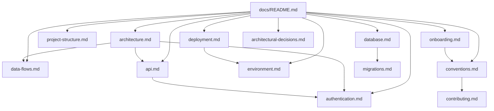

# Documentação técnica — Guia de Bolso

**Fonte única** de documentação para equipes de engenharia, DevOps, QA e produto. Aplicação em produção: [guia-de-bolso-puce.vercel.app](https://guia-de-bolso-puce.vercel.app).

Porta de entrada do repositório: [README.md](../README.md) (visão executiva). Contexto para agentes de IA: [CLAUDE.md](../CLAUDE.md).

---

## Comece aqui

| Perfil | Rota de leitura |
|--------|-----------------|
| **Desenvolvedor novo** | [Onboarding técnico](./onboarding.md) → [Estrutura de pastas](./project-structure.md) → [Arquitetura](./architecture.md) → [Convenções](./conventions.md) |
| **DevOps / release** | [Deploy](./deployment.md) → [Variáveis de ambiente](./environment.md) → [Migrations](./migrations.md) |
| **Backend / dados** | [Banco de dados](./database.md) → [Arquitetura do banco](./DATABASE_ARCHITECTURE.md) → [Fluxo de dados](./data-flows.md) → [RLS](./security-rls.md) |
| **API / integrações** | [APIs HTTP](./api.md) → [Autenticação](./authentication.md) → [Decisões arquiteturais](./architectural-decisions.md) |
| **Produto / QA** | [Features](./features.md) → [Checklist de testes](./TESTING-CHECKLIST.md) |

---

## Índice completo

### Fundamentos

| Documento | Conteúdo |
|-----------|----------|
| [**Onboarding técnico**](./onboarding.md) | Primeiros dias: setup, leituras, fluxos para validar |
| [**Estrutura de pastas**](./project-structure.md) | `app/`, `components/`, `lib/`, `supabase/`, `e2e/` |
| [**Arquitetura do sistema**](./architecture.md) | Stack, frontend/backend, integrações, diagramas |
| [**Fluxo de autenticação**](./authentication.md) | OAuth, SMS, sessão, admin, Premium |
| [**Fluxo de dados**](./data-flows.md) | Leituras, IA, writes, admin, analytics |
| [**Convenções**](./conventions.md) | Código, SQL, API, UI, Git, testes |
| [**Decisões arquiteturais**](./architectural-decisions.md) | ADRs aceitas e roadmap técnico |

### Dados e APIs

| Documento | Conteúdo |
|-----------|----------|
| [**APIs HTTP**](./api.md) | Route Handlers, códigos de erro, premium |
| [**Banco de dados**](./database.md) | Tabelas, colunas, RLS, RPC, queries comuns |
| [**Arquitetura do banco**](./DATABASE_ARCHITECTURE.md) | Modelagem, performance, índices, evolução |
| [**Migrations**](./migrations.md) | Ordem dos SQL em `/supabase` |
| [**Segurança RLS**](./security-rls.md) | Resumo de políticas |

### Operações

| Documento | Conteúdo |
|-----------|----------|
| [**Deploy**](./deployment.md) | Vercel, Supabase, CI, checklist produção |
| [**Variáveis de ambiente**](./environment.md) | Referência `.env` / Vercel / GitHub Actions |
| [**Staging**](./staging.md) | Preview e ambiente de homologação |
| [**Contribuição**](./contributing.md) | PR, scripts, áreas sensíveis |

### Produto e negócio

| Documento | Conteúdo |
|-----------|----------|
| [**Features**](./features.md) | Matriz de capacidades e regras de acesso |
| [**Taxonomia de lugares**](./taxonomia-lugares.md) | Subcategorias vs tags |
| [**Custos**](./CUSTOS.md) | Projeções e planilha |
| [**Changelog**](./CHANGELOG.md) | Histórico de releases |
| [**Testes (checklist)**](./TESTING-CHECKLIST.md) | QA manual |
| [**Legal (rascunho)**](./legal/) | Termos e privacidade |

### Segurança (raiz do repo)

| Arquivo | Conteúdo |
|---------|----------|
| [SECURITY.md](../SECURITY.md) | Como reportar vulnerabilidades |
| [SECURITY_CHECKLIST.md](../SECURITY_CHECKLIST.md) | Auditoria RLS/API |

---

## Mapa de dependência entre documentos



---

## Ordem de leitura recomendada

**Handoff completo para nova equipe:**

```text
README (raiz)
  → onboarding.md
  → project-structure.md
  → architecture.md
  → authentication.md
  → data-flows.md
  → api.md
  → database.md + DATABASE_ARCHITECTURE.md
  → migrations.md
  → environment.md
  → deployment.md
  → conventions.md + contributing.md
  → architectural-decisions.md
  → features.md
```

---

## Arquivos relacionados (fora de `docs/`)

| Arquivo | Uso |
|---------|-----|
| `.env.example` | Template de variáveis |
| `/supabase/*.sql` | DDL, RLS, RPC |
| `ENGINEERING_GUIDE.md` | Atalho para esta pasta |
| `CODING_STANDARDS.md` | Estilo linha a linha (complementa convenções) |
| `AGENTS.md` | Regras Cursor / Next.js 16 |

---

## Assets

| Pasta | Uso |
|-------|-----|
| [`screenshots/`](./screenshots/) | Capturas para README (390×844) |

---

## Links rápidos

| Recurso | URL |
|---------|-----|
| App produção | https://guia-de-bolso-puce.vercel.app |
| Repositório | https://github.com/BrunoDislilerDev/guia-de-bolso |
| Health check | `/api/health` |
| Supabase (região) | `us-west-2` |
