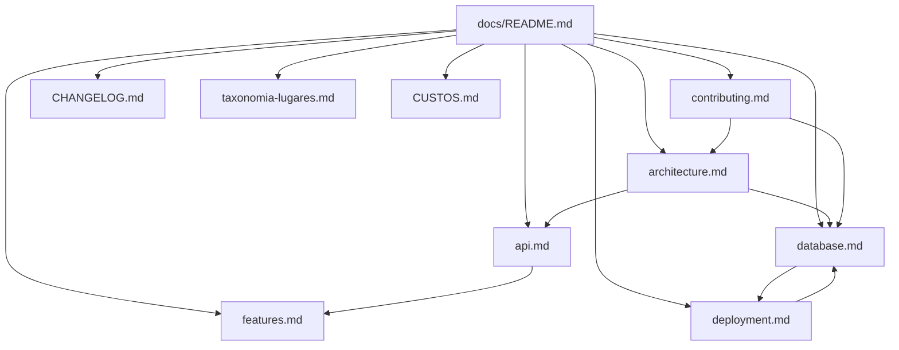

# Documentation

Technical documentation for **[Guia de Bolso](https://guia-de-bolso-puce.vercel.app)** — a mobile-first local discovery app for Imbituba (SC, Brazil).

New to the project? Start with the [root README](../README.md), then follow the [recommended reading order](#recommended-reading-order) below.

---

## Documentation index

| Document | Description |
|----------|-------------|
| [**Architecture**](./architecture.md) | System design: frontend, backend, data flows, authentication, third-party services |
| [**Database**](./database.md) | PostgreSQL schema, relationships, RLS policies, SQL migrations, common queries |
| [**API**](./api.md) | HTTP reference for `/api/buscar`, `/api/roteiro`, `/api/uso-premium`, and related contracts |
| [**Features**](./features.md) | User-facing capabilities: goals, flows, edge cases, and access by role |
| [**Deployment**](./deployment.md) | Vercel + Supabase: env vars, build steps, CI/CD, production checklist |
| [**Contributing**](./contributing.md) | Local setup, conventions, branching, and pull request guidelines |
| [**Changelog**](./CHANGELOG.md) | Release history (Semantic Versioning) |
| [**Testing checklist**](./TESTING-CHECKLIST.md) | Manual QA — interactive checklist at [`/checklist-testes.html`](../public/checklist-testes.html) (153 cases, mobile/tablet/desktop) |
| [**Costs & revenue**](./CUSTOS.md) | Monthly costs (R$), AI usage, B2B/B2C projections — edit with [`custos-planilha.csv`](./custos-planilha.csv) |
| [**Place taxonomy**](./taxonomia-lugares.md) | Subcategorias vs tags; admin `/admin/taxonomia` |
| [**Legal (draft)**](./legal/) | Privacy policy & terms — source in `lib/legalContent.js`; review with counsel before formal release |

---

## By topic

### Build & run locally

1. [Contributing → Getting started](./contributing.md#getting-started)
2. Copy [`.env.example`](../.env.example) to `.env.local`
3. [Database → Migration checklist](./database.md#migration-checklist-new-environment)
4. `npm install` → `npm run dev`

### Ship to production

1. [Deployment → Environment variables](./deployment.md#environment-variables)
2. [Deployment → Supabase production setup](./deployment.md#supabase-production-setup)
3. [Deployment → Production checklist](./deployment.md#production-checklist)

### Understand the product

1. [Features](./features.md) — what users can do
2. [Architecture](./architecture.md) — how it is built
3. [API](./api.md) — server endpoints for AI and premium

### Operate & extend data

1. [Database](./database.md) — tables, RLS, RPC functions
2. SQL scripts in [`/supabase`](../supabase/)
3. [API](./api.md) — when adding server-side behavior

---

## Recommended reading order

**For developers joining the team**

```text
README (root) → Architecture → Database → API → Contributing → Features
```

**For DevOps / release**

```text
Deployment → Database (migrations) → Architecture (env & services)
```

**For finance / launch planning**

```text
CUSTOS.md → custos-planilha.csv (Excel/Sheets)
```

**For product / QA**

```text
Features → TESTING-CHECKLIST → API (limits & auth) → Deployment (preview URLs)
```

---

## Related project files

| File | Purpose |
|------|---------|
| [README.md](../README.md) | Project overview, quick start, stack summary |
| [CLAUDE.md](../CLAUDE.md) | AI agent context (stack, structure, business rules) |
| [AGENTS.md](../AGENTS.md) | Cursor / agent rules for Next.js |
| [.env.example](../.env.example) | Environment variable template |
| [`/supabase`](../supabase/) | SQL migrations and storage policies |

---

## Assets

| Path | Purpose |
|------|---------|
| [`screenshots/`](./screenshots/) | README and marketing screenshots (see `.gitkeep` for naming) |

---

## Quick links

| Resource | URL |
|----------|-----|
| Production app | https://guia-de-bolso-puce.vercel.app |
| GitHub repository | https://github.com/BrunoDislilerDev/guia-de-bolso |
| Supabase region | `us-west-2` (see [Database](./database.md)) |

---

## Document map


