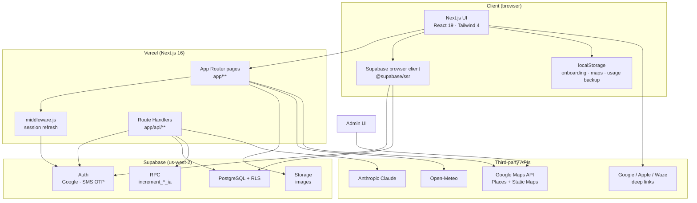
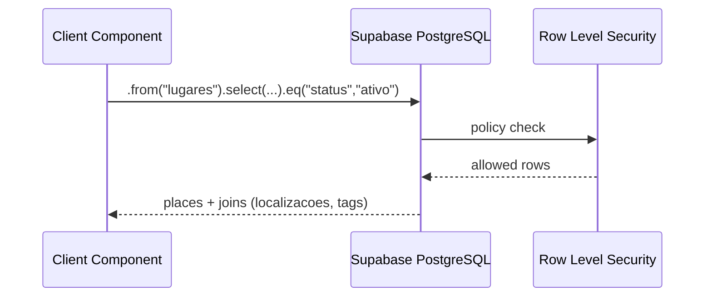
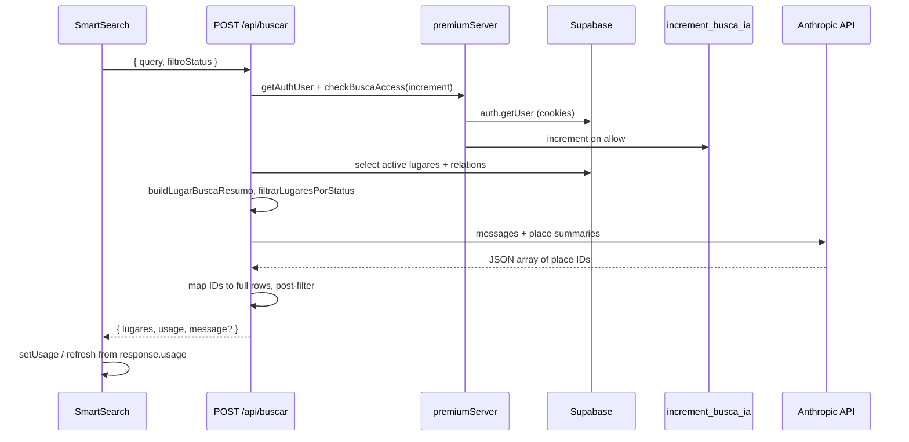
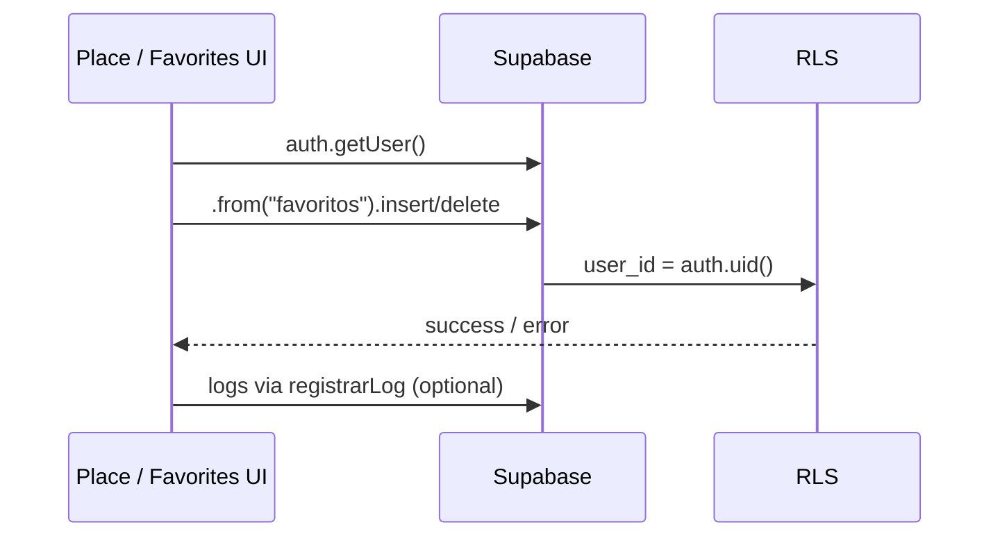
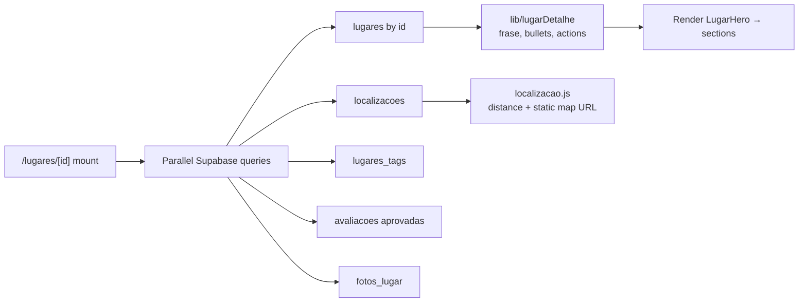
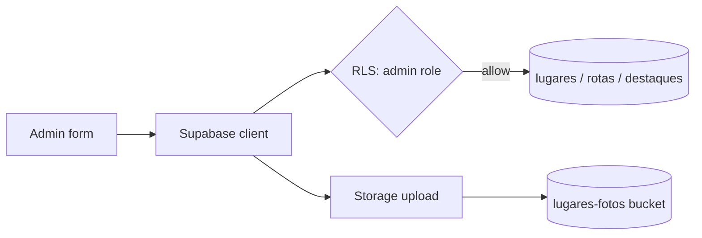
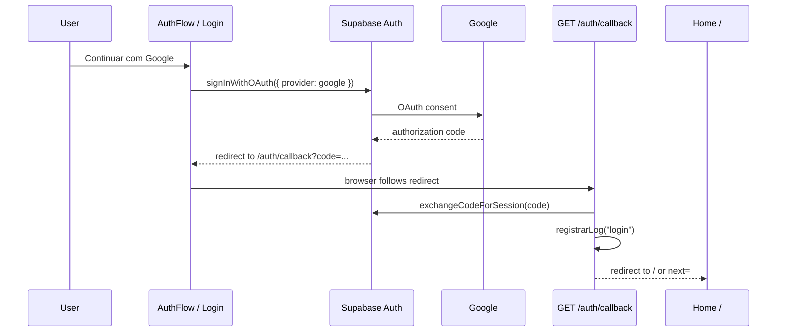
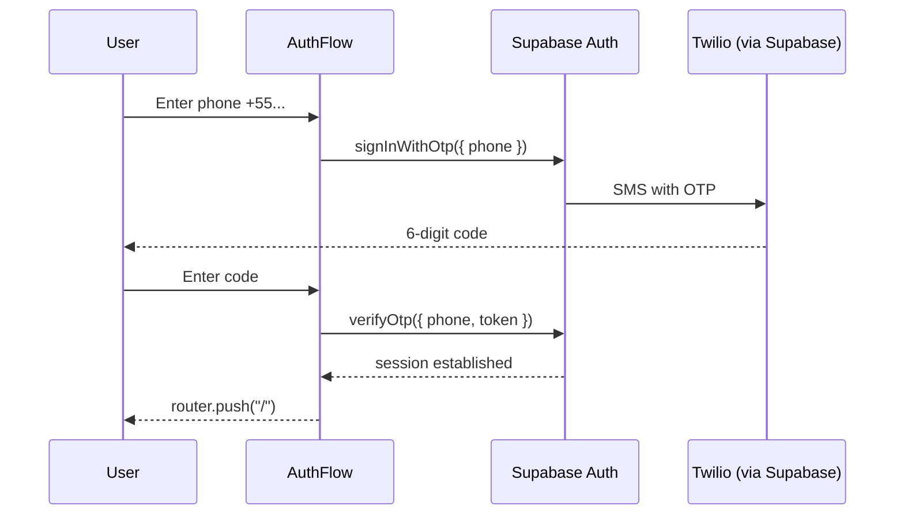

# System architecture

Guia de Bolso is a **mobile-first web application** for local discovery in Imbituba (Santa Catarina, Brazil). The system helps users decide what to do in real time by combining curated place data, live context (hours, geolocation, weather-aware copy), moderated reviews, and **Anthropic Claude**–powered search and trip planning.

This document describes how the frontend, backend, data plane, authentication, and external services fit together in production.

---

## System context



| Property | Value |
|----------|--------|
| **Deployment** | Vercel (serverless Next.js) |
| **Data region** | Supabase `us-west-2` |
| **Primary language** | JavaScript (no TypeScript) |
| **Session model** | Supabase Auth cookies via `@supabase/ssr` |

---

## Frontend architecture

### Framework and rendering model

The UI is built with **Next.js 16 App Router**. The root layout (`app/layout.js`) is a Server Component that sets fonts (Inter, Plus Jakarta Sans), global CSS, and `lang="pt-BR"`.

Almost all product surfaces are **Client Components** (`"use client"`) because they depend on:

- React hooks (`useState`, `useEffect`, `useRef`)
- Browser APIs (`navigator.geolocation`, `localStorage`, `navigator.share`)
- Supabase auth state listeners
- Interactive search overlays and bottom sheets

There is no global React Context for auth or premium; each page or hook loads session and usage as needed.

### Route map (consumer)

| Route | Module | Purpose |
|-------|--------|---------|
| `/` | `app/page.js` | Decision-oriented home |
| `/lugares/[id]` | `app/lugares/[id]/page.js` | Conversion-focused place detail |
| `/categorias`, `/categoria/[slug]` | Category discovery |
| `/favoritos` | Saved places (auth) |
| `/rotas`, `/rotas/[id]` | Curated routes + AI itineraries |
| `/perfil`, `/perfil/editar` | User profile |
| `/login` | `app/login/page.js` | Auth entry |
| `/auth/callback` | `app/auth/callback/route.js` | OAuth code exchange (Route Handler) |

### Route map (admin)

Requires `perfis.role` ∈ `admin`, `dev` (`lib/adminRoles.js` → `canAccessAdmin`). Primary CMS path is **`/admin/locais`**; `/admin/lugares` re-exports the same grid.

| Route | Purpose |
|-------|---------|
| `/admin` | Dashboard (hero, KPI grid, moderation queue, operational summary, activity timeline) |
| `/admin/locais`, `/admin/locais/novo`, `/admin/locais/[id]/editar` | Place CRUD |
| `/admin/lugares` | Legacy alias of locais grid |
| `/admin/rotas`, `/admin/rotas/nova`, `/admin/rotas/[id]/editar` | Curated route CRUD |
| `/admin/avaliacoes` | Review moderation (`?tab=` for filter chips) |
| `/admin/destaques` | Commercial highlights (`?status=expirando` \| `expirado`) |
| `/admin/usuarios` | User management, roles, Premium IA |
| `/admin/logs` | Activity log browser (`?acao=`, `?user_id=`, period filters) |
| `/admin/taxonomia` | CRUD for `subcategorias` and `tags` (no manual SQL) |

### Component organization

Components are grouped by **domain**, not by atomic design tier:

```
components/
├── home/                  # Home (header, search, hero, ParceirosCarrossel, trending, plans)
├── explorar/              # Explorar screen (/categorias): busca, atalhos, category cards
├── perfil/                # Profile hero, stats, settings groups, sheets
├── lugar/                 # Place detail (hero, actions, climate widget, reviews, CTA)
├── admin/                 # CMS: shell (sidebar/drawer/top bar), dashboard, grids, taxonomia, logs
├── rotas/                 # RoteiroSection, RoteiroContent, bottom sheet
├── BottomNav.js           # Consumer bottom navigation
├── LoginModal.js
├── Onboarding.js
├── PremiumPaywallSheet.js
├── DailyLimitCountdown.js
├── AuthFlow.js
├── ClimaCard.js           # Beach weather (not mounted on home today)
└── …                      # Other root-level UI (maps, autocomplete, etc.)
```

**Home** logic is driven by `lib/homeContext.js` (quick-search chips, `pickHeroLugar` scoring, preset plans; `getFraseContextual` for chips, not the header). Header weather is inline in `HomeContextHeader`. **Place detail** uses `lib/lugarDetalhe.js` to distinguish public venues (beaches, trails) from establishments (restaurants, services) and to shape quick actions.

### Client-side state patterns

| Concern | Mechanism |
|---------|-----------|
| Auth session | `createClient()` from `lib/supabase/client.js` → `getUser()`, `onAuthStateChange` |
| Premium usage | `usePremiumUsage` → hydrate `localStorage` (`guia_premium_usage_{userId}`) for current day → `GET /api/uso-premium` (server wins); exposes `loading` / `synced`; countdown via `DailyLimitCountdown` (`msUntilReset` optional) |
| Recent places (search) | `lib/lugaresVisitados.js` → `localStorage` |
| Preferred maps app | `localStorage` key `map_app_preferido` |
| Onboarding | `localStorage` key `onboarding_visto` |
| Geolocation | `navigator.geolocation` on home and place detail for distance |

### UI constraints

- **Mobile-first**: content column ~`max-w-md`, centered on desktop
- **Design tokens** (`app/globals.css`): `--color-primary` (`#1a4a3a`), `--color-background` (`#f0f4f3`), `--color-muted` (`#5a6b66`), `--color-surface`, etc. Tailwind still uses hex literals in many components; tokens are the canonical palette for new work.
- **Dark mode**: `@media (prefers-color-scheme: dark)` overrides are **commented out** until a full theme ships (avoids half-themed OS dark mode).
- **Focus**: global `*:focus-visible` outline (brand green, 2px).
- **Navigation**: floating `BottomNav` on main consumer routes (`aria-label` on nav and links).

### Image delivery

Place and route covers use **`next/image`** (not raw ``) on main list/detail surfaces: `PlaceCard`, `EmAltaCard`, `SearchListItem`, `LugarHero`, `/rotas` list and detail.

`next.config.mjs` whitelists remote hosts:

| Host | Path |
|------|------|
| `rsdjbqzjdyeaedyqwrvc.supabase.co` | `/storage/v1/object/public/**` |
| `picsum.photos` | (dev/placeholder) |

Above-the-fold cards may pass `priority` (first `EmAltaCard`, first `PlaceCard` in “Perto de você”). Exception: `OQueFazerAgora` hero still uses ``.

### Home data loading (resilience)

`app/page.js` splits fetches into two `useEffect` hooks:

```text
Phase 1 (primary):  fetchLugaresAtivos + fetchLugaresPopularesHome  →  Promise.allSettled
Phase 2 (secondary): fetchLugaresProximos + fetchClimaApis            →  Promise.allSettled
```

- Each phase maps failures to `sectionErrors` flags (`hero`, `emAlta`, `perto`, `clima`).
- Failed sections render `SectionUnavailable` (gray copy) instead of failing silently.
- Critical path (hero + trending) unblocks `homeLoading` before “Perto de você” finishes.

### Client error surfaces

Error UI is **page-local** (not shared components under `components/`):

| Pattern | Defined in | Notes |
|---------|------------|--------|
| `SectionUnavailable` | `app/page.js` | Per-section soft failure on home |
| `ErrorBanner` (`role="alert"`) | `app/lugares/[id]/page.js`, `app/categoria/[slug]/page.js`, `app/favoritos/page.js` | Red banner; retry via `router.refresh()` where applicable |
| Inline search error | `SmartSearch` / `SearchResultsPanel` | AI/network failures |
| `saveError` banner | `components/admin/RotaForm.js` | Failed route save |

Bottom sheets on place detail and profile use **`role="dialog"`**, **`aria-modal="true"`**, and **`aria-labelledby`** (`useId()`).

### Admin frontend

Admin pages wrap content in **`AdminShell`**, which uses `useAdminAuth()`:

1. Load session via browser Supabase client.
2. Fetch `perfis` row for current user.
3. Redirect to `/` if unauthenticated or `role` is not admin-capable (`lib/adminRoles.js`).

There is **no server-side admin layout guard**; protection is client-side plus RLS on writes.

**Layout (`AdminShell` + subcomponents):**

| Piece | Role |
|-------|------|
| `AdminSidebar.js` | Fixed green nav (`#1a4a3a`) on `lg+`; collapsible to icon-only (~72px); SVG nav from `adminNavConfig.js` |
| `AdminNavDrawer.js` | Slide-over nav on `< lg` (replaces horizontal chip nav) |
| `AdminTopBar.js` | Sticky bar: breadcrumb `Admin / {title}`, `AdminAlertsBell`, optional `headerAction` slot |
| `useAdminAuth` | Exported from `AdminShell.js` (unchanged contract) |

Shell props: `title`, `subtitle`, `headerAction`, `contentClassName`, `children`, and optional **`showPageHeading`** (default `true`; dashboard sets `false` and uses `DashboardHero` for the title block).

**Dashboard-only components** (`app/admin/page.js`): `DashboardHero`, `DashboardMetricCard`, `DashboardPendentesSection`, `DashboardOperacionalSidebar`, `DashboardAtividadeSection`, `DashboardSkeleton`; metrics helpers in `lib/adminDashboard.js`.

**Other admin libs:** `lib/adminLogs.js` (log listing/filters), `lib/adminRelatorios.js` + `lib/relatorioPdf.js` (establishment metrics, WhatsApp copy, PDF), `lib/adminTaxonomia.js` (subcategoria/tag CRUD), `lib/adminAlertas.js` + `AdminAlertsBell.js` (operational alerts, `localStorage` read state).

---

## Backend architecture

The “backend” is not a separate service. It consists of:

1. **Next.js Route Handlers** (`app/api/**`) — serverless functions on Vercel  
2. **Supabase** — database, auth, storage, RLS, RPC  
3. **Middleware** — session cookie refresh on every matched request  

### Supabase clients (three entry points)

| Export | File | Used for |
|--------|------|----------|
| Browser client | `lib/supabase/client.js` | Client Components, auth, direct reads/writes under RLS |
| Server client | `lib/supabase/server.js` | Route Handlers, OAuth callback, cookie-aware session |
| Anon service client | `lib/supabase.js` → `supabase` | Route Handlers that query places without user session (e.g. load catalog before auth check) |

```text
lib/supabase.js
├── export { createClient } from "./supabase/client"   // browser
└── export const supabase = createSupabaseClient(...)   // anon key, no cookies
```

### API routes (serverless)

| Endpoint | Auth | Responsibility |
|----------|------|----------------|
| `POST /api/buscar` | Required (non-empty `query`) | Premium check → load places → Claude ranking → filter → `increment_busca_ia`; empty `query` returns `{ lugares: [] }` without auth |
| `POST /api/roteiro` | Required | Generate itinerary (Claude), premium check, token-optimized prompt |
| `POST /api/roteiro/salvar` | Required | Insert into `roteiros` |
| `GET /api/uso-premium` | Optional | Returns `{ loggedIn, usage }`; `usage` when session present |

Server-only secrets: `ANTHROPIC_API_KEY`, `ANTHROPIC_MODEL`. These never use the `NEXT_PUBLIC_` prefix.

### Domain services (`lib/`)

| Module | Layer | Role |
|--------|-------|------|
| `premium.js` | Shared | Daily limits, `getUsageDayKey()`, `isSameUsageDay()`, `normalizeUsageFromPerfil`, `isDailyBuscaLimitReached` |
| `premiumServer.js` | Server | `getAuthUser`, `checkBuscaAccess`, RPC increment wrappers |
| `busca.js` | Shared | Open/closed filter, compact summaries for Claude |
| `horarios.js` | Shared | Brazil timezone hours: `parseHorarioDia`, `validarIntervalos`, `getStatusFuncionamento` (multi-shift + overnight carry-over, optional `mostrar_horarios` for badges, optional `referencia` for tests), `horariosTemCadastro`; tests in `lib/horarios.test.js` |
| `horizontalCarousel.js` | Client | Shared horizontal snap helpers for place/route photo carousels (`LugarHero`, `RotaGaleria`) |
| `localizacao.js` | Shared | Haversine distance, `withDistanciaDinamica` |
| `logs.js` | Shared | Insert into `logs` for analytics |
| `storageUpload.js` | Client | Admin photo upload to Storage (uses `imageCompress.js` when over 200KB) |
| `imageCompress.js` | Client | Canvas resize/JPEG for avatars and entity photos |
| `homeContext.js` | Shared | Hero scoring (`pickHeroLugar`), quick-search chips, preset plans, `getMelhorHorario` (null without hours) |
| `lugarDetalhe.js` | Shared | Establishment vs public place, quick actions, persuasion copy, `getStaticMapUrl` (Google Static Maps) |
| `lugaresPopulares.js` | Shared | Trending places by favorite count |
| `lugaresVisitados.js` | Client | Recent places in `localStorage` for search browse |
| `clima.js` | Shared | Open-Meteo weather/marine; `fetchClimaApisCached`, `lugarExibeClima`; home header + hero temp + `LugarClimaWidget` |
| `fotos.js` / `photoItems.js` | Shared | Cover URL helpers for places and routes |
| `tags.js` | Shared | Tag chips from `lugares_tags` / `rotas_tags` joins |
| `rotas.js` | Shared | Fixed route type catalog (`CATEGORIAS_ROTA`); `MAX_TAGS_ROTA` = 5 |
| `adminRoles.js` | Shared | `canAccessAdmin`, role chips, `user` → `usuario` normalization |
| `adminDashboard.js` | Client | Dashboard KPI counts, period variation, hero summary (`buildResumoOperacional`) |
| `adminLogs.js` | Client | Admin log filters, pagination, badges (`getLogAcaoBadgeAdmin`) |
| `adminTaxonomia.js` | Client | Subcategoria/tag CRUD, usage guards, `tags.aplica_em_rotas` fallback |
| `adminAlertas.js` | Client | Aggregated admin alerts (reviews, places, destaques, account deletion) |
| `destaques.js` | Shared | Vigent highlights, `ehParceiro` enrichment for home/search/AI |
| `planoComercial.js` | Shared | Single Parceiro plan fetch/ensure (`PLANO_COMERCIAL_PRECO`) |
| `categorias.js` | Shared | Explorar category catalog, sort, featured picks |
| `perfil.js` | Shared | Profile quick-link definitions |
| `avaliacaoAspectos.js` | Shared | Aspect chip options per place category |
| `roteiroParse.js` | Shared | Markdown → days/periods/stops for timeline UI |
| `roteiroMarkdown.js` / `roteiroLugares.js` | Server/shared | Legacy markdown helpers and catalog filtering for AI |
| `usePremiumUsage.js` | Client | Premium quota hook + `localStorage` cache |
| `googleMaps.js` | Client | Admin map picker helpers |

### Middleware

`middleware.js` runs on almost all routes (excluding static assets). It:

1. Creates a Supabase server client bound to request/response cookies.
2. Calls `supabase.auth.getUser()` to **refresh the session** if needed.
3. Returns `NextResponse.next()` with updated cookies.

Middleware does **not** enforce route-level auth; pages and APIs enforce access themselves.

### What is not on the server

- No standalone Express/FastAPI service  
- No Redis or message queue  
- No edge-configured rate limiting (limits are application-level via `perfis` + RPC)  
- No GraphQL layer  

---

## Data flow

### 1. Public read path (direct to Supabase)

Most read-only consumer data bypasses Next.js APIs and goes **browser → Supabase** under RLS:



**Performance notes (client):**

- **No N+1 ratings on cards:** `PlaceCard` / `EmAltaCard` read optional `rating_medio` or `media_avaliacoes` on the place object only (no per-card `avaliacoes` query).
- **`/categorias`:** one `select("categoria")` on active rows, counts reduced in JS (not nine `count` queries).

Typical joins on place detail:

- `lugares` + `localizacoes` + `lugares_tags` → `tags`
- `fotos_lugar` or JSON `fotos` on place row
- `avaliacoes` where `status = 'aprovada'`

### 2. AI search path



**Post-processing:** Client may apply `withDistanciaDinamica` after results return. Status filter can run **before** AI (narrow catalog) and **after** AI (safety net).

### 3. Authenticated write path (favorites, reviews)



Reviews insert with `status: 'pendente'`; public reads only see `aprovada`.

### 4. Place detail load path



`saveLugarVisitado` writes to `localStorage` for search browse panel.

### 5. Admin write path



### 6. Roteiro (itinerary) path

1. User completes form on `/rotas` (logged in).  
2. `POST /api/roteiro` — premium check, filtered place list (`lib/roteiroLugares.js`), Claude returns strict markdown + `lugaresCatalog`.  
3. `lib/roteiroParse.js` → `RoteiroItineraryView` in `RoteiroBottomSheet` / `RoteiroViewModal`.  
4. Optional `POST /api/roteiro/salvar` — persists to `roteiros` table.  
5. Saved trips reopen in the same timeline UI (`RoteiroSection`).

---

## Authentication flow

Authentication is fully delegated to **Supabase Auth**. The app does not implement custom JWT logic.

### Session transport

- **Cookies** managed by `@supabase/ssr` (`createBrowserClient` / `createServerClient`).
- **Middleware** refreshes session on each navigation.
- **Server Route Handlers** read the same cookies via `lib/supabase/server.js`.

### Google OAuth



Callback implementation: `app/auth/callback/route.js`.

### SMS OTP (phone)



Phone validation: 11 digits (DDD + number), formatted in UI. Resend is rate-limited in the client (counter + cooldown).

### Profile bootstrap

On first login, Supabase creates `auth.users`. The app expects a matching row in **`perfis`** (same `id`). Profile fields (`nome`, `foto_url`, `role`, premium columns) are read on admin check and profile pages. Creation may occur via trigger or first profile update—verify in Supabase project settings.

### Authorization (not authentication)

| Layer | Mechanism |
|-------|-----------|
| **Premium features** | `perfis.premium_ativo`; daily counters `buscas_ia` / `roteiros_ia` in `uso_ia_mes` (day key `YYYY-MM-DD`, SP); limits 5 buscas + 2 roteiros/day; Premium unlimited |
| **Admin** | `perfis.role` ∈ `admin`, `dev` (`canAccessAdmin`) |
| **Public content** | RLS: active places, approved reviews |
| **Gated UI** | `LoginModal` for favorites, reviews, **AI search**, and **AI roteiro**; curated `/rotas` list and route detail are public |

API returns machine-readable codes: `LOGIN_REQUIRED` (401), `LIMIT_REACHED` (403).

### Auth state on the home page

`app/page.js`:

1. `supabase.auth.getUser()` on mount.  
2. `onAuthStateChange` to update user + clear favorites on sign-out.  
3. Premium hook `usePremiumUsage(user)` hydrates same-day cache, then fetches `/api/uso-premium`; home search and `/rotas` show usage + `DailyLimitCountdown` when limit reached.

---

## Third-party services

| Service | Integration point | Purpose | Credentials |
|---------|-------------------|---------|-------------|
| **Supabase** | `lib/supabase/*`, all data/auth | PostgreSQL, Auth, Storage, RLS, RPC | `NEXT_PUBLIC_SUPABASE_URL`, `NEXT_PUBLIC_SUPABASE_ANON_KEY` |
| **Anthropic Claude** | `app/api/buscar`, `app/api/roteiro` | Semantic search + itineraries | `ANTHROPIC_API_KEY`, `ANTHROPIC_MODEL` |
| **Vercel** | Git push → deploy | Hosting, serverless, CDN | Vercel project env vars |
| **Google OAuth** | Supabase Auth provider | Social login | Configured in Supabase dashboard |
| **Twilio** | Supabase Auth (SMS provider) | OTP delivery | Supabase + Twilio config |
| **Open-Meteo** | `lib/clima.js`, `LugarClimaWidget`, `ClimaSheet` | Weather/marine forecast (home + outdoor place detail) | None (public API) |
| **Google Maps** | `EnderecoAutocomplete`, `getStaticMapUrl`, user deep links | Places autocomplete (admin), Static Maps preview on detail, navigation | `NEXT_PUBLIC_GOOGLE_MAPS_API_KEY` (Places + Static Maps APIs) |
| **Apple Maps / Waze** | User-initiated deep links only | Turn-by-turn navigation | None |

### Anthropic API

- **Endpoint:** `https://api.anthropic.com/v1/messages`
- **Search:** low `max_tokens` (256), system prompt returns JSON array of place IDs only
- **Roteiro:** higher token budget, structured prompt, reduced place context via `lib/roteiroLugares.js`

### Supabase Auth providers

- **Google:** OAuth 2.0 redirect flow through `/auth/callback`
- **Phone:** OTP; Brazil numbers via `+55` prefix in `AuthFlow`

### Maps (client-side only)

No server-side routing API. `openRoute()` in place detail:

1. Reads `map_app_preferido` from `localStorage` or prompts sheet (Google / Apple / Waze).  
2. Opens provider URL with coordinates or address query.  
3. Logs `ir_agora` to `logs` table.

### Image storage

- **Buckets:** `lugares-fotos`, `rotas-fotos` (see `supabase/storage-policies.sql`)
- **Upload:** `lib/storageUpload.js` from admin forms
- **Public URLs** stored on place/route/profile records
- **Delivery:** browser loads Storage URLs through **`next/image`** (optimized sizing, lazy load) where integrated; URLs must match `images.remotePatterns` in `next.config.mjs`

---

## Security architecture (summary)

| Control | Implementation |
|---------|----------------|
| **RLS** | Required on production tables; repo versions policies for `perfis`, `logs`, and Storage — anonymous users read only public catalog data |
| **Server-side AI** | API keys never exposed to browser |
| **Usage integrity** | `increment_busca_ia` / `increment_roteiro_ia` as `SECURITY DEFINER` RPC |
| **Review moderation** | Public select policy on `status = aprovada` only |
| **Admin** | Role check in UI + RLS on mutations |
| **HTTPS** | Enforced by Vercel in production |

---

## Deployment topology

```text
GitHub (main)
    → Vercel build (npm run build)
        → Serverless functions (pages + /api/*)
        → Static assets (CDN)
    → Environment variables (Supabase + Anthropic)

Supabase project (us-west-2)
    → PostgreSQL
    → Auth
    → Storage CDN
```

Single-region deployment. No multi-region failover documented.

---

## Related documentation

- [Database schema & RLS](./database.md)
- [HTTP API reference](./api.md)
- [Feature matrix](./features.md)
- [Deployment runbook](./deployment.md)
