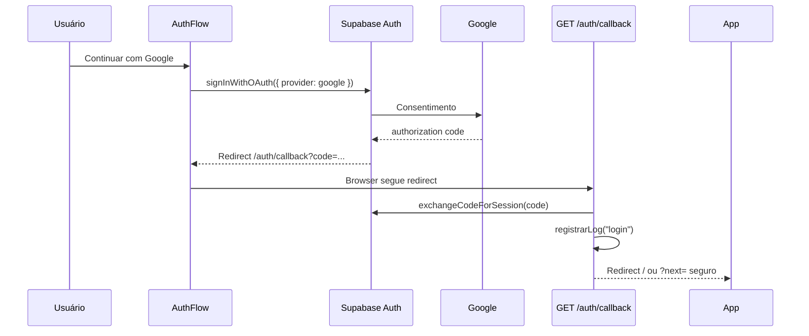
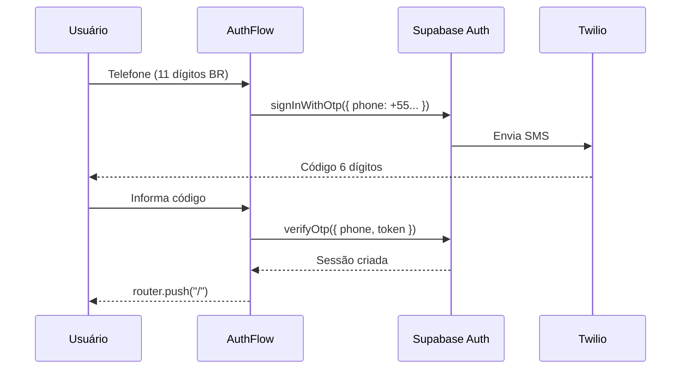
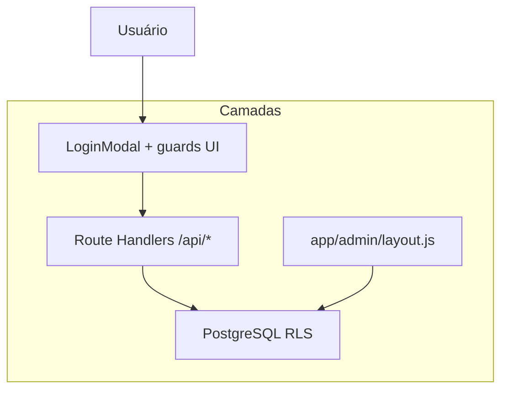

# Fluxo de autenticação

Autenticação e autorização no **Guia de Bolso**. Implementação delegada ao **Supabase Auth**; a aplicação não emite JWT próprio.

Visão de sistema: [`architecture.md`](./architecture.md#authentication-flow).

---

## Modelo de sessão

| Aspecto | Detalhe |
|---------|---------|
| Transporte | Cookies HTTP gerenciados por `@supabase/ssr` |
| Cliente browser | `lib/supabase/client.js` → `createBrowserClient` |
| Server (Route Handlers, layouts) | `lib/supabase/server.js` → `createServerClient` |
| Refresh | `middleware.js` chama `auth.getUser()` em cada request elegível |
| Expiração | Política padrão Supabase (refresh automático via middleware) |

**Não há** Context global React de auth — cada página/hook chama `getUser()` ou `onAuthStateChange` conforme necessário.

---

## Provedores habilitados

| Provedor | UI | Configuração |
|----------|-----|--------------|
| **Google OAuth** | `AuthFlow` / `/login` | Supabase Dashboard → Authentication → Google |
| **SMS OTP** | `AuthFlow` | Supabase + **Twilio** (OTP 6 dígitos, `+55`) |

Apple Sign In e WhatsApp Auth estão no roadmap (dependências externas).

---

## Fluxo Google OAuth

**Arquivo:** `app/auth/callback/route.js`

- Usa `safeRedirectPath()` para `?next=` ([`lib/safeRedirectPath.js`](../lib/safeRedirectPath.js)) — evita open redirect.
- Registra evento em `logs` após sessão válida.

### URLs obrigatórias (Supabase)

| Ambiente | Site URL | Redirect URL |
|----------|----------|--------------|
| Local | `http://localhost:3000` | `http://localhost:3000/auth/callback` |
| Produção | `https://guia-de-bolso-puce.vercel.app` | `.../auth/callback` |
| Preview Vercel | URL do preview | `https://<preview>/auth/callback` |

Detalhes: [`environment.md`](./environment.md), [`deployment.md`](./deployment.md#1-auth-url-configuration).

---

## Fluxo SMS OTP

- Validação de formato no cliente (DDD + número).
- Reenvio com cooldown no UI (não substitui rate limit do Supabase).

---

## Perfil de aplicação (`perfis`)

Após `auth.users` criado:

| Campo | Uso |
|-------|-----|
| `id` | Igual a `auth.users.id` (UUID) |
| `nome`, `foto_url` | Perfil público |
| `role` | `usuario`, `admin`, `dev`, `estabelecimento` |
| `premium_ativo`, `premium_ate` | Guia Premium |
| `buscas_ia`, `roteiros_ia`, `uso_ia_mes` | Cotas IA (dia `YYYY-MM-DD` SP) |
| `maps_preferido` | App de navegação preferido |

Bootstrap: `lib/ensurePerfil.js` (primeiro acesso). Confirme triggers/policies no projeto Supabase.

---

## Autorização (após login)

Autenticação ≠ autorização. Camadas:

| Recurso | Regra |
|---------|--------|
| Ver lugares ativos | Público (RLS + `status = 'ativo'`) |
| Favoritos, avaliar | Login + RLS `auth.uid()` |
| Busca IA, roteiro IA | Login + cotas ([`api.md`](./api.md)) |
| Reviews públicas | Somente `status = 'aprovada'` |
| Admin CMS | `role` ∈ `admin`, `dev` (`lib/adminRoles.js` → `canAccessAdmin`) |

### Guard admin (servidor + cliente)

1. **Servidor:** `app/admin/layout.js` — sem sessão → `/login?next=/admin`; sem role admin → `/?admin=denied`.
2. **Cliente:** `AdminShell` + `useAdminAuth` — UX e redirect rápido.

**Nunca** confiar só no cliente para operações sensíveis — RLS nas tabelas de escrita.

### Premium (uso IA)

| Tier | Buscas IA/dia | Roteiros IA/dia |
|------|---------------|-----------------|
| Gratuito (logado) | 5 | 2 |
| Premium | Ilimitado | Ilimitado |

Reset: meia-noite **America/Sao_Paulo**. Incremento atômico: RPC `increment_busca_ia`, `increment_roteiro_ia`.

Cliente: `usePremiumUsage` + `GET /api/uso-premium` (servidor vence sobre `localStorage`).

Códigos API: `LOGIN_REQUIRED` (401), `LIMIT_REACHED` (403), `RATE_LIMITED` (429).

---

## Conteúdo restrito sem login

`LoginModal` (bottom sheet) em:

- Favoritar
- Enviar avaliação
- Busca IA e geração de roteiro IA

Rotas curadas (`/rotas`, detalhe de rota) permanecem **públicas** para leitura.

---

## Logout e exclusão de conta

- Logout: `supabase.auth.signOut()` na página de perfil (com confirmação).
- Exclusão de conta: fluxo na UI de perfil — ver implementação atual e policies Supabase antes de alterar.

Eventos analytics: `lib/logs.js` → tabela `logs`.

---

## Checklist de debug auth

| Sintoma | Verificar |
|---------|-----------|
| Loop no login | Redirect URLs no Supabase |
| Sessão some no refresh | `middleware.js` matcher; cookies bloqueados |
| Admin nega acesso | `perfis.role`, layout server |
| IA sempre 401 | Cookies em domínio preview vs produção |
| Cota não zera | Fuso `America/Sao_Paulo`, RPC e `uso_ia_mes` |

---

## Referências

- [`data-flows.md`](./data-flows.md) — writes autenticados
- [`security-rls.md`](./security-rls.md) — políticas RLS
- [`api.md`](./api.md) — endpoints que exigem sessão
