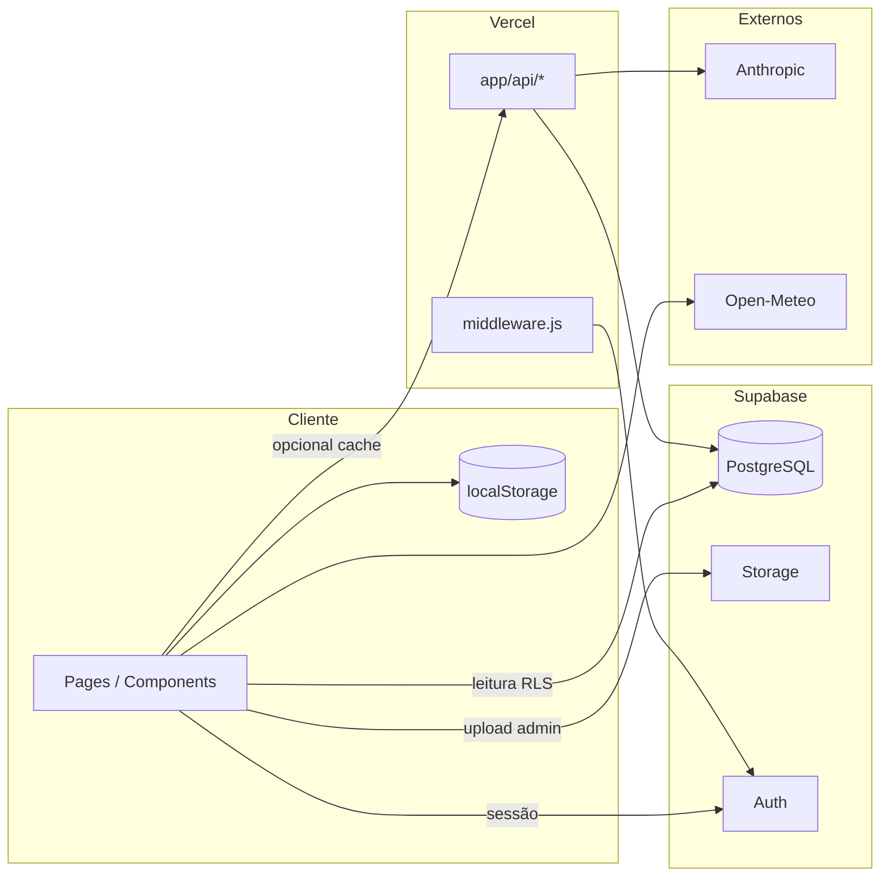
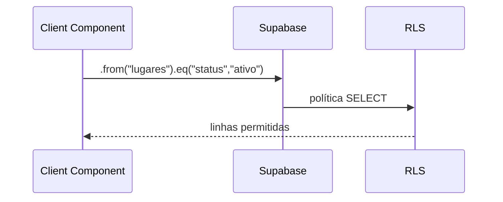
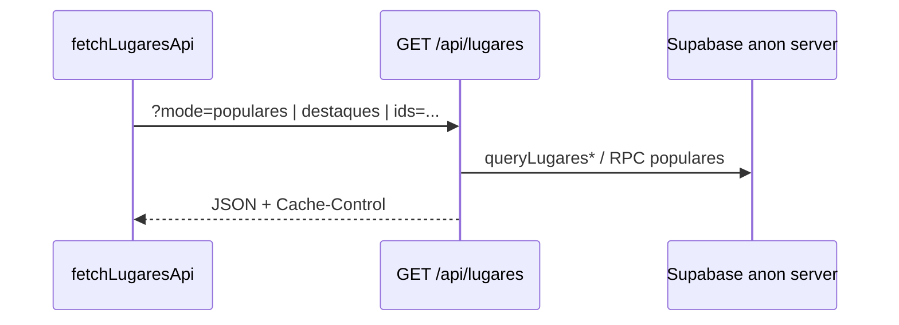
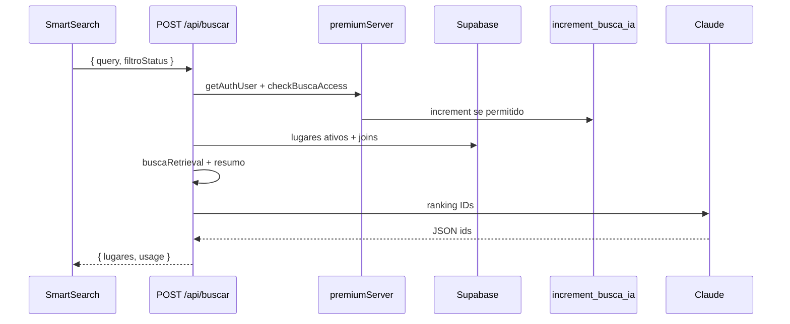
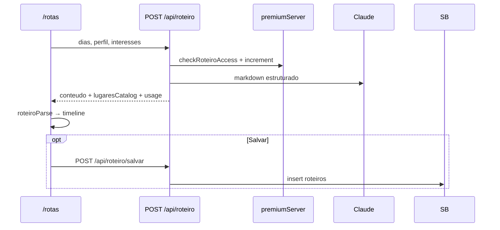
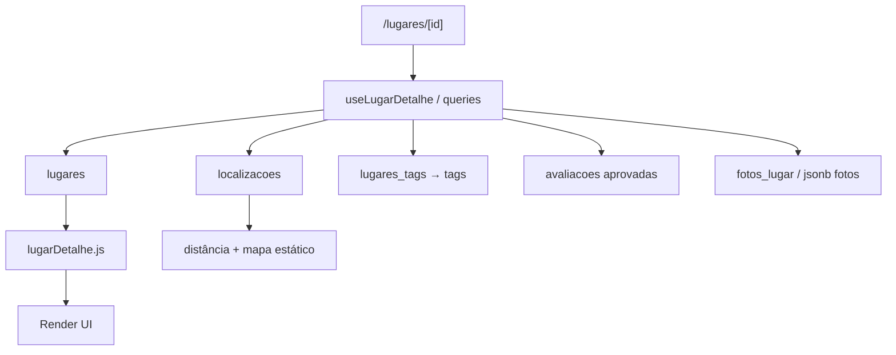
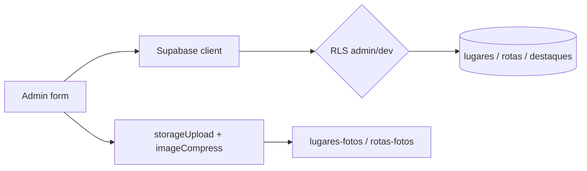
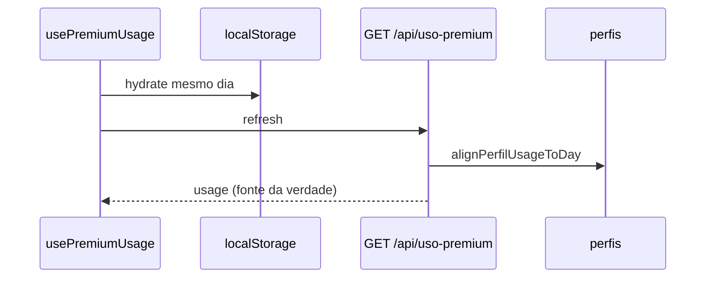

# Fluxo de dados

Como os dados trafegam entre **browser**, **Next.js (Vercel)** e **Supabase**. Diagramas detalhados também em [`architecture.md`](./architecture.md#data-flow).

---

## Princípio central

| Tipo de operação | Caminho preferido |
|------------------|-------------------|
| Leitura pública do catálogo | Browser → Supabase (RLS) **ou** `GET /api/lugares` (cache CDN) |
| Escrita do usuário (favorito, avaliação) | Browser → Supabase (RLS) |
| IA, cotas, service role pontual | Browser → `app/api/*` → Supabase / Anthropic |
| Admin CMS | Browser → Supabase (RLS admin) + Storage |
| Analytics | Browser → `logs` via `lib/logs.js` |

**Regra:** segredos (`ANTHROPIC_API_KEY`, `SUPABASE_SERVICE_ROLE_KEY`) **nunca** no cliente.

---

## Mapa de fluxos



---

## 1. Leitura pública do catálogo

### Caminho A — Supabase direto (maioria das telas)



**Onde:** home (fetches em `app/page.js`), categorias, detalhe, favoritos.

**Otimizações:**

- Cards não fazem N+1 de avaliações — usam `rating_medio` / `media_avaliacoes` na linha do lugar.
- `/categorias`: uma query de contagem por categoria, agregação em JS.

### Caminho B — API com cache (`GET /api/lugares`)



**Query params:** `mode=populares`, `mode=destaques`, `ids=1,2,3`, `limit`, `categoria`.

Headers: `lib/apiCacheHeaders.js` (CDN-friendly).

---

## 2. Busca por linguagem natural (IA)



**Pré-filtro:** `lib/buscaRetrieval.js` reduz tokens antes do Claude.

**Pós-filtro:** `lib/busca.js` → aberto/fechado (`filtroStatus`).

**Cliente:** distância dinâmica com GPS (`lib/localizacao.js`).

---

## 3. Roteiro IA



Exclusão: `DELETE /api/roteiro/[id]` (dono da linha, RLS).

---

## 4. Escritas do usuário autenticado

| Entidade | Operação | Tabela | Estado inicial |
|----------|----------|--------|----------------|
| Favorito | insert/delete | `favoritos` | — |
| Avaliação | insert | `avaliacoes` | `pendente` |
| Roteiro salvo | insert | `roteiros` | — |
| Perfil | update | `perfis` | — |
| Feedback | insert | `feedback` | guest pode usar service role no servidor |

Após avaliação:

```text
insert avaliacoes → POST /api/avaliacoes/analisar → sugestao_ia para fila admin
```

Moderação humana em `/admin/avaliacoes` → `aprovada` / `rejeitada`.

---

## 5. Detalhe do lugar



Visitas recentes: `lib/lugaresVisitados.js` → `localStorage` (busca).

Clima outdoor: `lib/clima.js` → Open-Meteo (sem API key).

---

## 6. Admin — CMS e Storage



Relatórios PDF/WhatsApp: `lib/adminRelatorios.js`, `lib/qrPdf.js`.

QR público: `GET /q/[slug]` → log `escaneou_qr` (service role) → redirect detalhe.

---

## 7. Premium e uso IA



Após `POST /api/buscar` ou roteiro: UI atualiza `usage` da resposta (`setUsage`).

---

## 8. Observabilidade de produto

| Evento | Destino |
|--------|---------|
| `login`, `logout`, `favorito`, `ir_agora`, `visualizou_lugar`, `acessou_app`, `escaneou_qr` | Tabela `logs` |
| Erros de UI | `lib/observability.js` → console (Sentry opcional) |
| Deploy smoke | `GET /api/health` |

Admin consulta: `/admin/logs`.

Retenção: `supabase/logs_retention.sql` (quando aplicado).

---

## 9. Dados que não passam pelo backend Next

| Dado | Origem |
|------|--------|
| Clima header/hero | Open-Meteo direto do browser |
| Navegação Maps/Waze/Apple | Deep links (`openRoute`) |
| Preferência app mapas | `localStorage` + opcional `perfis.maps_preferido` |
| Onboarding visto | `localStorage` |

---

## Anti-padrões (evitar)

- Buscar `ANTHROPIC_API_KEY` no Client Component.
- Incrementar `buscas_ia` com `update` direto no browser.
- Confiar só em `useAdminAuth` sem RLS nas escritas.
- Tratar `lugares.id` como UUID (produção usa **`bigint`**).

---

## Referências

- [`api.md`](./api.md)
- [`database.md`](./database.md)
- [`DATABASE_ARCHITECTURE.md`](./DATABASE_ARCHITECTURE.md)
