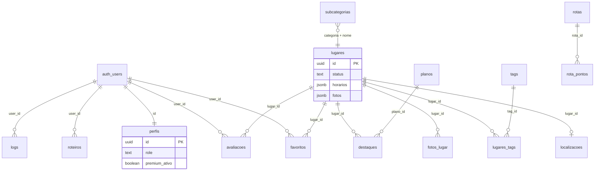

# Database

The application database runs on **Supabase (PostgreSQL)** in region **`us-west-2`**. **Row Level Security (RLS)** is required on production tables; only **`perfis`**, **`logs`**, and **Storage** policies are versioned in [`/supabase`](../supabase) — other table policies must exist in the Supabase Dashboard (see [RLS](#row-level-security-rls)). Schema changes are applied manually in the **Supabase SQL Editor** (no automated migration runner in CI).

**Auth users** live in Supabase’s `auth.users` schema. App data lives in `public`.

---

## Entity relationship diagram



**Note:** The `categorias` table described in early project docs is **not queried by the app**. Categories are fixed in UI code; `subcategorias` links to category **by name** (`subcategorias.categoria` text), not by FK.

---

## Tables and columns

Columns marked *(migration)* come from files in `/supabase`. Others are inferred from application usage and may exist in the live project without a repo migration file.

### `auth.users` (Supabase managed)

Not in `public`. Referenced by `perfis.id`, `favoritos.user_id`, `avaliacoes.user_id`, `roteiros.user_id`, `logs.user_id`.

| Column | Description |
|--------|-------------|
| `id` | UUID primary key — same as `perfis.id` |
| `email`, `phone` | Login identifiers |
| `raw_user_meta_data` | OAuth name, avatar hints |

---

### `perfis`

One row per registered user. Extends auth with app profile, admin role, and AI/premium usage.

| Column | Type | Description |
|--------|------|-------------|
| `id` | `uuid` PK | = `auth.users.id` |
| `nome` | `text` | Display name |
| `foto_url` | `text` | Avatar public URL (Storage `imagens` bucket) |
| `role` | `text` | `dev`, `admin`, `usuario`, `estabelecimento` — see `perfis_role_check.sql` |
| `maps_preferido` | `text` | `google`, `apple`, `waze` (optional; app also uses `localStorage`) |
| `created_at` | `timestamptz` | Profile creation |
| `premium_ativo` | `boolean` | Subscription flag *(migration: `premium_usuario.sql`)* |
| `premium_ate` | `timestamptz` | Expiry; `NULL` = no end date *(migration)* |
| `uso_ia_mes` | `text` | **Day bucket** `YYYY-MM-DD` (America/Sao_Paulo); column name is legacy. `isSameUsageDay()` in `lib/premium.js` also accepts legacy `YYYY-MM` on **read** and in server fallback increments; RPC `increment_*_ia` compares exact `YYYY-MM-DD` only *(migration)* |
| `buscas_ia` | `integer` | AI searches used **today** *(migration)* |
| `roteiros_ia` | `integer` | AI itineraries used **today** *(migration)* |

**Free tier limits** (enforced in app + RPC): **3 searches/day**, **2 roteiros/day**; counters reset at **midnight** (SP). Premium: unlimited (`lib/premium.js`). See `supabase/premium_uso_diario.sql` (column comment).

---

### `lugares`

Core content: beaches, restaurants, trails, services, etc.

| Column | Type | Description |
|--------|------|-------------|
| `id` | `bigint` PK | Serial/numeric id (not uuid in production) |
| `nome` | `text` | Display name |
| `descricao` | `text` | Short description |
| `descricao_longa` | `text` | Long “about” copy |
| `categoria` | `text` | Natureza, Gastronomia, Noite, Serviços, Hospedagem, Cultura, Aventura, Bem-estar, Compras |
| `subcategoria` | `text` | e.g. Praias, Restaurantes — must match `subcategorias.nome` for same `categoria` |
| `status` | `text` | `ativo`, `desativado`, `em_analise` — public app only reads `ativo` |
| `horarios` | `jsonb` | Weekly hours: keys `dom`…`sab`, values `fechado`, `24h`, or `HH:MM-HH:MM` |
| `telefone` | `text` | Phone |
| `instagram` | `text` | Handle or URL |
| `cardapio_url` | `text` | Menu link |
| `site_url` | `text` | Website |
| `endereco` | `text` | *(legacy — may be absent in some DBs)* Admin saves address in `localizacoes` only |
| `mostrar_endereco` | `boolean` | Show address/map block on place detail *(migration: `lugares_visibilidade.sql`)* |
| `mostrar_horarios` | `boolean` | Show hours UI and open/closed badges when `horarios` is set *(migration)* |
| `imagem_url` | `text` | Legacy cover; first photo synced here on save |
| `fotos` | `jsonb` | Array of public image URLs *(migration: `fotos_migration.sql`)* |
| `destaque` | `boolean` | Legacy highlight flag on row |
| `distancia` | `text` | Legacy static label; app prefers `localizacoes` + GPS (`distancia_calculada`) |
| `rating_medio` | `numeric` | *(optional, not in repo migrations)* — if present, `PlaceCard` / `EmAltaCard` show stars without extra queries |
| `media_avaliacoes` | `numeric` | *(optional alias)* — same client read path as `rating_medio` |
| `created_at` | `timestamptz` | |

Until an aggregate column or view exists, cards omit the rating chip; detail page still loads approved `avaliacoes` for the full list.

---

### `localizacoes`

Structured address and coordinates (1:1 with `lugares`).

| Column | Type | Description |
|--------|------|-------------|
| `lugar_id` | `uuid` PK/FK | → `lugares.id`, upsert `onConflict: lugar_id` |
| `rua`, `numero`, `bairro`, `cidade`, `estado`, `cep`, `pais` | `text` | Address parts |
| `endereco_completo` | `text` | Full formatted address |
| `latitude`, `longitude` | `float` | Used for distance, maps, static map preview |

---

### `fotos_lugar`

Optional normalized photo gallery (legacy path; app merges with `lugares.fotos` JSON).

| Column | Type | Description |
|--------|------|-------------|
| `id` | (serial/uuid) | PK |
| `lugar_id` | `uuid` FK | → `lugares` |
| `url` / `imagem_url` / `foto_url` | `text` | App reads any of these field names |

---

### `tags`

Controlled vocabulary for place attributes (pet friendly, vista mar, etc.).

| Column | Type | Description |
|--------|------|-------------|
| `id` | `integer` PK | |
| `nome` | `text` | Label |
| `categorias` | `jsonb` | Array of category names where tag is valid *(migration: `tags_categorias.sql`)* |
| `aplica_em_rotas` | `boolean` | When true, tag appears in admin route form *(migration: `rotas_taxonomia.sql`)* |

Admin limits **3 tags per place**. Filtering: `lib/tags.js` (`filterTagsByCategoria`).

---

### `lugares_tags`

Join table **many-to-many** `lugares` ↔ `tags`.

| Column | Type | Description |
|--------|------|-------------|
| `lugar_id` | `uuid` FK | |
| `tag_id` | `integer` FK | → `tags.id` |

Admin replaces all rows on save: `delete` by `lugar_id`, then `insert` batch.

---

### `subcategorias`

Lookup for admin and category pages. **Not** FK-linked to `lugares`; matched by `lugares.categoria` + `lugares.subcategoria` text.

| Column | Type | Description |
|--------|------|-------------|
| `id` | (serial/uuid) | PK |
| `categoria` | `text` | Parent category name |
| `nome` | `text` | Broad place type only (e.g. Praias, Trilhas — not Surfe/pôr do sol; those are **tags**) |
| `icone` | `text` | Optional emoji shown in admin and category chips |

Queried with `.eq("categoria", form.categoria)` in admin and `.eq("categoria", slug)` on `/categoria/[slug]`.

---

### `favoritos`

User bookmarks.

| Column | Type | Description |
|--------|------|-------------|
| `id` | (serial/uuid) | PK |
| `user_id` | `uuid` FK | → `auth.users` |
| `lugar_id` | `uuid` FK | → `lugares` |
| `created_at` | `timestamptz` | |

Unique constraint expected on `(user_id, lugar_id)` for idempotent favoriting.

---

### `avaliacoes`

User reviews with moderation.

| Column | Type | Description |
|--------|------|-------------|
| `id` | `uuid` | PK |
| `lugar_id` | `uuid` FK | |
| `user_id` | `uuid` FK | |
| `nota` | `integer` | 1–5 |
| `comentario` | `text` | Optional |
| `aspectos` | `jsonb` | Selected aspect labels from structured form (default `[]`) |
| `sugestao_ia` | `text` | Claude pre-moderation hint (`aprovar` / `rejeitar` / `revisar` + reason) |
| `status` | `text` | `pendente`, `aprovada`, `rejeitada` |
| `created_at` | `timestamptz` | |

Public reads: `status = 'aprovada'`. Inserts default to `pendente`. After insert, client calls `POST /api/avaliacoes/analisar`. Admin approves/rejects. Migration: `supabase/avaliacoes_moderacao.sql`.

Some selects join `profiles:user_id(...)` (Supabase view); fallback select uses `*` only.

---

### `rotas`

Admin-managed curated routes (trails, city walks). **Distinct from** AI `roteiros`.

| Column | Type | Description |
|--------|------|-------------|
| `id` | `uuid` | PK |
| `nome` | `text` | Display title |
| `descricao` | `text` | |
| `cidade` | `text` | e.g. Imbituba |
| `categoria` | `text` | Tipo de experiência — valores fixos em `lib/rotas.js` (Trilha, Passeio urbano, …) |
| `dificuldade` | `text` | Fácil, Médio, Difícil |
| `duracao_minutos` | `integer` | |
| `distancia_km` | `numeric` | |
| `destaque` | `boolean` | Only one featured at a time (admin clears others) |
| `ativa` | `boolean` | Soft visibility |
| `foto_capa` / `imagem_capa` | `text` | Legacy cover URLs |
| `fotos` | `jsonb` | Gallery URLs *(migration: `fotos_migration.sql`)* |
| `created_at` | `timestamptz` | |

**Tags:** junction `rotas_tags` → `tags` (subset com `tags.aplica_em_rotas = true`). Admin: máx. 3 tags; replace on save.

---

### `rotas_tags`

Join table **many-to-many** `rotas` ↔ `tags` (subset de tags aplicáveis a rotas).

| Column | Type | Description |
|--------|------|-------------|
| `id` | `uuid` | PK |
| `rota_id` | `uuid` FK | → `rotas.id` |
| `tag_id` | `integer` FK | → `tags.id` |

Admin replaces all rows on save: `delete` by `rota_id`, then `insert` batch. Filtering: `lib/tags.js` (`filterTagsParaRotas`, `getTagsFromRota`).

---

### `rota_pontos`

Ordered steps for a `rotas` row.

| Column | Type | Description |
|--------|------|-------------|
| `id` | (serial/uuid) | PK |
| `rota_id` | `uuid` FK | → `rotas` |
| `ordem` | `integer` | Step sequence |
| `nome` | `text` | Step title |
| `descricao` | `text` | Step instruction *(legado; prefer `rota_ponto_detalhes`)* |
| `lugar_id` | `bigint` FK (nullable) | *(legado, não usado no app)* |

Detalhes ordenados em **`rota_ponto_detalhes`** (várias descrições por ponto). Admin: delete pontos da rota (cascade) e re-insert.

---

### `rota_ponto_detalhes`

Ordered description lines for each `rota_pontos` row.

| Column | Type | Description |
|--------|------|-------------|
| `id` | `uuid` | PK |
| `ponto_id` | `uuid` FK | → `rota_pontos.id` |
| `ordem` | `integer` | Line sequence |
| `texto` | `text` | Description line |

*(migration: `rota_ponto_detalhes.sql`)*

---

### `rota_dicas`

Ordered tips for a `rotas` row, shown at the bottom of `/rotas/[id]`.

| Column | Type | Description |
|--------|------|-------------|
| `id` | `uuid` | PK |
| `rota_id` | `uuid` FK | → `rotas` |
| `ordem` | `integer` | Tip sequence |
| `texto` | `text` | Tip content |
| `created_at` | `timestamptz` | |

Admin: delete all tips for route, re-insert on save *(migration: `rota_dicas.sql`)*.

---

### `rotas_localizacoes`

Structured address and coordinates (1:1 with `rotas`). Used by **Abrir no Maps** on `/rotas/[id]`; endereço **não** é exibido no app.

| Column | Type | Description |
|--------|------|-------------|
| `rota_id` | `uuid` PK/FK | → `rotas.id`, upsert `onConflict: rota_id` |
| `rua`, `numero`, `bairro`, `cidade`, `estado`, `cep`, `pais` | `text` | Address parts |
| `endereco_completo` | `text` | Full formatted address |
| `latitude`, `longitude` | `float` | Map pin / navigation target |

*(migration: `rotas_localizacoes.sql`)*

---

### `roteiros`

User-saved **AI-generated** trip plans (not admin `rotas`).

| Column | Type | Description |
|--------|------|-------------|
| `id` | `uuid` | PK |
| `user_id` | `uuid` FK | Owner |
| `titulo` | `text` | |
| `dias` | `text` | Trip length label |
| `perfil` | `text` | Traveler profile |
| `interesses` | `jsonb` / array | Interest tags |
| `conteudo` | `text` | Markdown/body from Claude |
| `created_at` | `timestamptz` | |

Written by `POST /api/roteiro/salvar`; listed on `/rotas` when logged in.

---

### `planos`

Commercial highlight **pricing tiers** (Básico, Padrão, Premium).

| Column | Type | Description |
|--------|------|-------------|
| `id` | (serial) | PK — app uses numeric ids in admin forms |
| `nome` | `text` | Plan name — app V1 uses single row **Parceiro** (R$ 199/mês) via `lib/planoComercial.js` |
| `frequencia` | `text` | e.g. `mensal` |
| `preco` | `numeric` | BRL |

---

### `destaques`

Scheduled promotional slots linking a place to a plan.

| Column | Type | Description |
|--------|------|-------------|
| `id` | (serial) | PK |
| `lugar_id` | `uuid` FK | → `lugares` |
| `plano_id` | FK | → `planos.id` |
| `data_inicio`, `data_fim` | `date` | Active window |
| `ativo` | `boolean` | Manual on/off |

---

### `logs`

Product analytics and audit trail.

| Column | Type | Description |
|--------|------|-------------|
| `id` | (serial/uuid) | PK |
| `user_id` | `uuid` FK | → `perfis.id` ON DELETE SET NULL *(migration: `logs_policies.sql`)* |
| `user_email` | `text` | Denormalized |
| `user_nome` | `text` | Denormalized |
| `acao` | `text` | e.g. `login`, `favoritou`, `ir_agora`, `acessou_app` |
| `detalhes` | `jsonb` | Context (place name, maps app, page, etc.) |
| `created_at` | `timestamptz` | |

Inserted via `lib/logs.js` → `registrarLog()`.

---

## Relationships summary

| From | To | Cardinality | Join / notes |
|------|-----|-------------|--------------|
| `perfis` | `auth.users` | 1:1 | Same `id` |
| `localizacoes` | `lugares` | 1:1 | `lugar_id` |
| `lugares_tags` | `lugares`, `tags` | N:M | `lugar_id`, `tag_id` |
| `favoritos` | `lugares`, user | N:1 | `user_id`, `lugar_id` |
| `avaliacoes` | `lugares`, user | N:1 | Moderation on `status` |
| `destaques` | `lugares`, `planos` | N:1 each | Date range + `ativo` |
| `rotas_tags` | `rotas`, `tags` | N:M | `rota_id`, `tag_id` |
| `rota_pontos` | `rotas` | N:1 | Ordered by `ordem` |
| `rota_ponto_detalhes` | `rota_pontos` | N:1 | Ordered description lines |
| `rota_dicas` | `rotas` | N:1 | Ordered tips by `ordem` |
| `rotas_localizacoes` | `rotas` | 1:1 | `rota_id`; maps/navigation only |
| `roteiros` | user | N:1 | Private to owner |
| `logs` | `perfis` | N:1 | Optional `user_id` |
| `subcategorias` | `lugares` | Logical | Text match on `categoria` + `nome`, not FK |

### Common Supabase select patterns

```text
*, localizacoes(*), lugares_tags(tags(*))     -- home, search, category, popular places
*, lugares(nome)                              -- admin reviews, destaques
*, planos(nome, frequencia, preco)            -- destaques list
id,lugar_id,lugares!inner(*)                  -- favoritos with place embed
*, rotas_tags(tags(*))                        -- routes list/detail
*, lugares(id, nome)                          -- route steps with optional place link
```

---

## Row Level Security (RLS)

RLS policies for **`rotas`** and related tables are in [`rotas_policies.sql`](../supabase/rotas_policies.sql) (`is_admin_user()` helper; public read active routes; admin/dev write).

### Documented policies in repo

| Object | Policy | File | Effect |
|--------|--------|------|--------|
| `perfis` | `perfis_select_own` | `perfis_premium_policies.sql` | `SELECT` where `auth.uid() = id` |
| `perfis` | `perfis_insert_own` | same | `INSERT` own row |
| `perfis` | `perfis_update_own` | same | `UPDATE` own row |
| `logs` | `Admin lê logs` | `logs_policies.sql` | `SELECT` with `USING (true)` — **very permissive**; rely on admin UI gate |
| `storage.objects` | lugares-fotos / rotas-fotos | `fotos_migration.sql` | Authenticated upload/update; public read |
| `storage.objects` | `imagens` avatars | `storage-policies.sql` | Insert/update only under `avatars/{user_id}/` |

### Expected policies (inferred from app)

| Table | `anon` / public | `authenticated` | Admin (`role` in `admin`, `dev`) |
|-------|-----------------|-----------------|-------------------------------------|
| `lugares` | `SELECT` where `status = 'ativo'` | Same | `INSERT`/`UPDATE`/`DELETE` all statuses |
| `localizacoes`, `fotos_lugar`, `tags`, `subcategorias` | `SELECT` | `SELECT` | Full write |
| `lugares_tags`, `rotas_tags` | `SELECT` | `SELECT` | Write via admin session |
| `favoritos` | — | `SELECT`/`INSERT`/`DELETE` own `user_id` | — |
| `avaliacoes` | `SELECT` where `status = 'aprovada'` | `INSERT` own; `SELECT` own pending | `SELECT` all; `UPDATE` status |
| `roteiros` | — | CRUD own `user_id` | — |
| `rotas`, `rota_pontos`, `rota_dicas` | `SELECT` active/public | `SELECT` | Full write |
| `destaques`, `planos` | `SELECT` active (if exposed) | — | Full write |
| `perfis` | — | Own row; admin may need broader `SELECT` for `/admin/usuarios` | Update any `role` |
| `logs` | — | `INSERT` (app) | `SELECT` (dashboard) |

**Admin access:** The app checks `perfis.role` in the client (`useAdminAuth`). RLS must still allow admin writes on content tables; otherwise admin CRUD fails even with UI access.

**Premium counters:** Updates to `buscas_ia` / `roteiros_ia` should go through **`increment_busca_ia`** / **`increment_roteiro_ia`** (`SECURITY DEFINER`) to avoid race conditions and RLS edge cases. Fallback: direct `perfis` update in `lib/premiumServer.js` when RPC is missing.

---

## SQL functions (RPC)

Defined in [`supabase/increment_uso_ia.sql`](../supabase/increment_uso_ia.sql).

| Function | Parameter | Returns | Purpose |
|----------|-----------|---------|---------|
| `increment_busca_ia` | `p_user_id uuid` | `jsonb` | Auth check, **daily** reset (`YYYY-MM-DD`), increment search count (limit 3/day), premium bypass |
| `increment_roteiro_ia` | `p_user_id uuid` | `jsonb` | Same for roteiros (limit 2/day); returns `resets_at` (next midnight SP) in `usage` |

**Return payload (conceptual):**

```json
{
  "allowed": true,
  "code": "OK",
  "message": "...",
  "usage": {
    "premium": false,
    "day": "2026-05-19",
    "month": "2026-05-19",
    "resets_at": "2026-05-20T03:00:00.000Z",
    "buscas": { "used": 1, "limit": 3, "remaining": 2 },
    "roteiros": { "used": 0, "limit": 2, "remaining": 2 }
  }
}
```

Codes: `LOGIN_REQUIRED`, `LIMIT_REACHED`, `OK`.

Granted to `authenticated`. Called from `lib/premiumServer.js` via `supabase.rpc()`.

---

## Storage buckets

| Bucket | Path pattern | Policies | Used by |
|--------|--------------|----------|---------|
| `lugares-fotos` | `{lugar_id}/{timestamp}-{name}.jpg` | `fotos_migration.sql` | Admin place photos |
| `rotas-fotos` | `{rota_id}/...` | `fotos_migration.sql` | Admin route photos |
| `imagens` | `avatars/{user_id}/avatar.jpg` | `storage-policies.sql` | Profile photo upload |

Legacy bucket name **“Guia de Bolso - Imagens”** may still host older assets.

---

## Migration checklist (new environment)

Run SQL scripts from [`/supabase`](../supabase) in a **fresh environment** in this order (adjust if your project already has base schema):

| Order | File | Purpose |
|-------|------|---------|
| 1 | Base schema | Tables created in Supabase UI / early scripts (not in repo) |
| 2 | `premium_usuario.sql` | Premium + usage columns on `perfis` |
| 3 | `increment_uso_ia.sql` | RPC functions for atomic **daily** counters (re-run after logic changes) |
| 3b | `premium_uso_diario.sql` | Optional: documents `uso_ia_mes` as daily key |
| 4 | `perfis_premium_policies.sql` | RLS on `perfis` for own-row access |
| 5 | `perfis_role_check.sql` | `CHECK (role IN (...))`, migrate `user` → `usuario` |
| 6 | `tags_categorias.sql` | `tags.categorias` jsonb + seed updates by tag id |
| 7 | `fotos_migration.sql` | `lugares.fotos`, `rotas.fotos` + Storage policies for photo buckets |
| 8 | `storage-policies.sql` | Avatar policies on `imagens` |
| 9 | `logs_policies.sql` | FK `logs.user_id` → `perfis`, permissive read policy |
| 10 | `lugares_visibilidade.sql` | `lugares.mostrar_endereco`, `lugares.mostrar_horarios` (default `true`) |
| 11 | `taxonomia_lugares_cleanup.sql` | Canonical subcategorias per category + migrate/remove redundant subs + seed detail **tags** (Surfe, etc.) |
| 11b | `subcategoria_piscinas_naturais.sql` | Superseded by `taxonomia_lugares_cleanup.sql` (kept for reference) |
| 12 | `rotas_taxonomia.sql` | `rotas_tags`, `tags.aplica_em_rotas`, `rota_pontos.lugar_id` |
| 13 | `rota_dicas.sql` | Ordered tips table `rota_dicas` |
| 14 | `rotas_policies.sql` | RLS on `rotas`, `rota_pontos`, `rota_dicas`, `rotas_tags` (admin write) |
| 15 | `rotas_localizacoes.sql` | Structured address/coords for routes (`rotas_localizacoes`) |
| 16 | `rota_ponto_detalhes.sql` | Multiple ordered descriptions per route step |
| 17 | `avaliacoes_moderacao.sql` | `aspectos`, `sugestao_ia` on `avaliacoes` |
| 18 | `plano_comercial_unico.sql` | Normalize single **Parceiro** commercial plan |
| 19 | `premium_uso_dia_fix.sql` | Optional: documents/fixes daily `uso_ia_mes` semantics |

---

## Main queries and use cases

### Consumer — home (`app/page.js`)

| Use case | Query |
|----------|--------|
| Active places (hero) | `lugares` `.select("*, localizacoes(*), lugares_tags(tags(*))")` `.eq("status","ativo")` `.limit(50)` — phase 1 |
| Trending (“Em alta”) | `fetchLugaresPopulares` (`lib/lugaresPopulares.js`): reads `favoritos`, then active `lugares` by top IDs — phase 1 |
| “Perto de você” | Active `lugares` `.limit(20)`, exclude hero/trending IDs client-side, `.slice(0, 6)`, sort by GPS |
| Parceiros carousel | `destaques` vigentes + active `lugares`; `buildParceiroIdSet` / `enrichLugaresComParceiro` (`lib/destaques.js`) |
| Favorites on home | `favoritos` `.select("lugar_id")` `.eq("user_id", user.id)` |
| AI search | **Not SQL** — `POST /api/buscar` loads catalog server-side |

### Consumer — place detail (`app/lugares/[id]/page.js`)

| Use case | Query |
|----------|--------|
| Place | `lugares` `.select("*")` `.eq("id")` `.eq("status","ativo")` |
| Photos | `fotos_lugar` by `lugar_id`; fallback `lugares.fotos` jsonb |
| Location | `localizacoes` `.maybeSingle()` |
| Tags | `lugares_tags` `.select("tags(*)")` |
| Reviews | `avaliacoes` `.eq("status","aprovada")` `.order("created_at")` |
| Favorite / review state | `favoritos` / `avaliacoes` by `user_id` + `lugar_id` |
| Submit review | `avaliacoes` `.insert({ status: "pendente", aspectos })` → `POST /api/avaliacoes/analisar` |

### Consumer — favorites (`app/favoritos/page.js`)

| Use case | Query |
|----------|--------|
| List with places | `favoritos` `.select("id,lugar_id,lugares!inner(*)")` or separate `lugares` `.in("id", ids)` |
| Remove | `favoritos` `.delete()` `.eq("user_id")` `.eq("lugar_id")` |

### Consumer — categories

| Use case | Query |
|----------|--------|
| Category grid counts | `lugares` `.select("categoria")` `.eq("status","ativo")` — aggregate counts in JS (`app/categorias/page.js`) |
| Filtered list | `lugares` + joins `.eq("categoria", ...)` `.eq("subcategoria", ...)` |
| Subcategory chips | `subcategorias` `.eq("categoria", slug)` |

### Consumer — routes & AI roteiros (`app/rotas`)

| Use case | Query |
|----------|--------|
| Curated routes | `rotas` `.select("*, rotas_tags(tags(*))")` (active/public per RLS) |
| Route detail steps | `rota_pontos` `.select("*, rota_ponto_detalhes(id, texto, ordem)")` |
| Route detail tips | `rota_dicas` `.select("*")` `.eq("rota_id")` `.order("ordem")` |
| Route maps target | `rotas_localizacoes` `.maybeSingle()` by `rota_id` |
| Saved AI trips | `roteiros` `.select("id, titulo, dias, ...")` `.eq("user_id")` |
| Generate itinerary | `POST /api/roteiro` — server reads `lugares` catalog |
| Save itinerary | `POST /api/roteiro/salvar` → `roteiros.insert` |

### API — AI search (`app/api/buscar/route.js`)

| Step | Query / call |
|------|----------------|
| Auth + quota | `getAuthUser()` → `increment_busca_ia` RPC (or fallback) |
| Catalog | `supabase` (anon) `.from("lugares")` `.select("*, localizacoes(*), lugares_tags(tags(*))")` `.eq("status","ativo")` |
| Rank | Anthropic API — returns place IDs only |
| Response | Map IDs to rows; client applies distance |

### Admin

| Use case | Query |
|----------|--------|
| Auth gate | `perfis` `.select("*")` `.eq("id", user.id)` — `canAccessAdmin(role)` |
| Places grid | `lugares` `.select("*, localizacoes(cidade)")` |
| Place CRUD | `lugares` insert/update; `localizacoes` upsert; `lugares_tags` replace |
| Routes CRUD | `rotas` + `rota_pontos` + `rota_ponto_detalhes` + `rota_dicas` + `rotas_tags` + `rotas_localizacoes` |
| Reviews moderation | `avaliacoes` `.update({ status })` |
| Highlights | `destaques` + joins `lugares`, `planos` |
| Users | `perfis` `.select("*")` `.update({ role })` |
| Dashboard (`/admin`) | `fetchCount` / `fetchCountInPeriod` (`lib/adminDashboard.js`): active `lugares`, pending `avaliacoes`, `perfis` created in period, `logs` with `acao = ir_agora` in period, `em_analise` count; `fetchDestaquesVigentes` + expiring-within-7d; `countPremiumAtivos`; recent `logs` (3 rows); pending review list (5 rows) |
| Logs admin (`/admin/logs`) | `logs` paginated/filtered via `lib/adminLogs.js` (`acao`, date range, `user_id`, text search on `user_nome` / `user_email` / `detalhes.lugar_nome`) |
| Taxonomia admin | `subcategorias` insert/update/delete (usage count on `lugares.categoria` + `lugares.subcategoria`); `tags` CRUD + `lugares_tags` / `rotas_tags` usage checks |

### Premium usage

| Use case | Query / call |
|----------|----------------|
| Read usage | `GET /api/uso-premium` → `perfis` select premium fields |
| Increment search | `rpc("increment_busca_ia", { p_user_id })` |
| Increment roteiro | `rpc("increment_roteiro_ia", { p_user_id })` |
| Client cache | `localStorage` key `guia_premium_usage_{userId}` — hydrate on load if `day` matches today; overwritten after successful `GET /api/uso-premium` or post-search `usage` payload (server is source of truth) |

### Analytics logging

| Event | `logs.acao` | Typical `detalhes` |
|-------|-------------|-------------------|
| OAuth callback | `login` | `{ provider }` |
| Favorite toggle | `favoritou` / `desfavoritou` | `{ lugar_id, lugar_nome }` |
| Navigation CTA | `ir_agora` | `{ lugar_id, lugar_nome, app: google\|apple\|waze }` |
| App open | `acessou_app` | `{ pagina }` |
| Account deletion | `deletou_conta` | (profile request; surfaced in admin alerts → `/admin/logs?acao=deletou_conta`) |

---

## Indexes and performance (recommendations)

Not defined in repo migrations. Suggested for production:

- `lugares(status, categoria)` — also supports `/categorias` single-pass count (`select categoria where status = ativo`)
- `lugares_tags(lugar_id)`, `lugares_tags(tag_id)`
- `favoritos(user_id)`, `favoritos(lugar_id)`
- `avaliacoes(lugar_id, status)`
- `localizacoes(lugar_id)` unique
- `logs(created_at DESC)`

---

## Related documentation

- [Architecture](./architecture.md) — how the app talks to Supabase
- [API](./api.md) — Route Handlers that use RPC and catalog queries
- [Deployment](./deployment.md) — env vars and migration checklist
