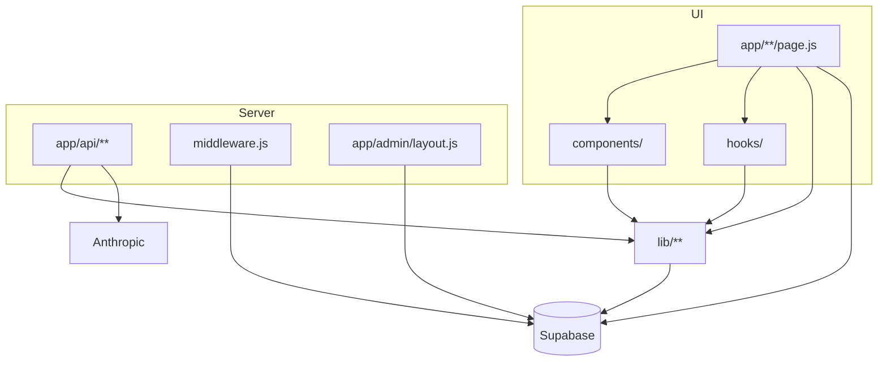

# Estrutura de pastas

Mapa do repositório **Guia de Bolso**. Convenções de colocação de código: [`conventions.md`](./conventions.md).

---

## Visão geral

```text
guia-de-bolso/
├── app/                    # Next.js 16 App Router (páginas + Route Handlers)
├── components/             # UI React por domínio de produto
├── hooks/                  # Hooks compartilhados (detalhe lugar, GPS, premium)
├── lib/                    # Lógica de negócio, Supabase, integrações
├── supabase/               # Migrations SQL (aplicação manual no Dashboard)
├── docs/                   # Documentação técnica (fonte única)
├── public/                 # Assets estáticos, onboarding, checklist QA
├── e2e/                    # Testes Playwright
├── .github/workflows/      # CI (lint, test, build)
├── middleware.js           # Refresh de sessão Supabase
├── next.config.mjs         # Imagens remotas, guard de env no build
├── vercel.json             # Headers de segurança HTTP
├── .env.example            # Template de variáveis → docs/environment.md
├── CLAUDE.md               # Contexto para agentes IA
├── AGENTS.md               # Regras Next.js 16 para Cursor
├── ENGINEERING_GUIDE.md    # Atalho → docs/ (não duplicar conteúdo)
└── README.md               # Porta de entrada do repositório
```

---

## `app/` — rotas e APIs

| Caminho | Tipo | Função |
|---------|------|--------|
| `app/page.js` | Page | Home (busca IA, hero, parceiros, perto de você) |
| `app/layout.js` | Layout | Fontes, `lang="pt-BR"`, providers globais |
| `app/login/page.js` | Page | Entrada Google + SMS |
| `app/auth/callback/route.js` | Route Handler | Troca código OAuth por sessão |
| `app/lugares/[id]/page.js` | Page | Detalhe do lugar |
| `app/categorias/page.js` | Page | Explorar categorias |
| `app/categoria/[slug]/page.js` | Page | Listagem filtrada |
| `app/favoritos/page.js` | Page | Favoritos (auth) |
| `app/rotas/page.js`, `app/rotas/[id]/page.js` | Page | Rotas curadas + roteiro IA |
| `app/perfil/`, `app/perfil/editar/` | Page | Perfil e edição |
| `app/admin/**` | Pages + `layout.js` | CMS — **guard server** em `admin/layout.js` |
| `app/api/**` | Route Handlers | IA, premium, catálogo cacheável, health |
| `app/q/[slug]/route.js` | Route Handler | QR → redirect lugar + log |
| `app/error.js`, `app/global-error.js` | Boundaries | Erros de UI |
| `app/privacidade/`, `app/termos/` | Page | Legal (conteúdo em `lib/legalContent.js`) |

### `app/api/`

| Arquivo | Método | Descrição |
|---------|--------|-----------|
| `buscar/route.js` | POST | Busca IA |
| `roteiro/route.js` | POST | Gera roteiro IA |
| `roteiro/salvar/route.js` | POST | Persiste roteiro |
| `roteiro/[id]/route.js` | DELETE | Remove roteiro salvo |
| `uso-premium/route.js` | GET | Cotas diárias IA |
| `lugares/route.js` | GET | Catálogo público (cache CDN) |
| `avaliacoes/analisar/route.js` | POST | Pré-moderação IA de avaliação |
| `feedback/route.js` | POST | Feedback usuário/guest |
| `health/route.js` | GET | Smoke de deploy |

Contratos: [`api.md`](./api.md).

---

## `components/` — interface

Organização **por domínio**, não por tipo atômico (Button/, Card/).

| Pasta | Conteúdo |
|-------|----------|
| `home/` | Header contextual, busca, hero, carrossel parceiros, Em alta |
| `explorar/` | Tela `/categorias` |
| `lugar/` | Detalhe (hero, ações, clima, avaliações, CTA) |
| `lugar/airbnb/` | Layout alternativo de detalhe |
| `rotas/` | Roteiro IA, timeline, sheets |
| `perfil/` | Hero, estatísticas, configurações |
| `admin/` | `AdminShell`, sidebar, drawer, formulários CMS |
| `shared/` | Galeria, headers reutilizáveis |
| `legal/` | Blocos de termos/privacidade |
| Raiz | `BottomNav`, `LoginModal`, `Onboarding`, `AuthFlow`, etc. |

---

## `hooks/`

| Hook | Uso |
|------|-----|
| `useLugarDetalhe.js` | Estado e fetches do detalhe de lugar |
| `useUserPosition.js` | Geolocalização com fallback |
| (em `lib/`) `usePremiumUsage.js` | Cotas IA + cache `localStorage` |

---

## `lib/` — domínio e integrações

~76 módulos na raiz. Agrupamento lógico:

| Grupo | Exemplos |
|-------|----------|
| **Supabase** | `supabase/client.js`, `server.js`, `supabase.js` (barrel + anon) |
| **Premium / IA** | `premium.js`, `premiumServer.js`, `iaRateLimit.js`, `busca.js`, `buscaRetrieval.js` |
| **Lugares** | `lugaresQuery.js`, `lugaresPopulares.js`, `lugarDetalhe.js`, `fetchLugaresApi.js` |
| **Home / contexto** | `homeContext.js`, `clima.js`, `destaques.js` |
| **Horários** | `horarios.js` (+ `horarios.test.js`) |
| **Rotas / roteiro** | `roteiroParse.js`, `roteiroLugares.js`, `rotas.js` |
| **Admin** | `adminRoles.js`, `adminDashboard.js`, `adminLogs.js`, `adminTaxonomia.js` |
| **UX / segurança** | `userMessages.js`, `safeRedirectPath.js`, `observability.js` |
| **Dados** | `data/lugarDetalheQueries.js` — queries Supabase extraídas de páginas grandes |

Testes unitários: `lib/*.test.js` (executados com `npm test`).

---

## `supabase/` — banco

Scripts `.sql` versionados, aplicados manualmente. **Não** é código da aplicação.

| Tipo de arquivo | Exemplo |
|-----------------|---------|
| Schema / colunas | `fotos_migration.sql`, `premium_usuario.sql` |
| RLS / policies | `perfis_premium_policies.sql`, `logs_policies.sql` |
| RPC | `increment_uso_ia.sql`, `lugares_populares_rpc.sql` |
| Storage | `storage-policies.sql`, `storage_admin_fotos.sql` |
| Índices | `db_indexes.sql`, `db_indexes_phase2.sql` |

Ordem de aplicação: [`migrations.md`](./migrations.md#manifest).

---

## `docs/` — documentação

Índice mestre: [`README.md`](./README.md). Não criar cópias da mesma informação na raiz do repo (exceto `README.md` enxuto e `CLAUDE.md`).

---

## `public/`

| Conteúdo | Uso |
|----------|-----|
| `onboarding/` | Imagens do fluxo de onboarding |
| `checklist-testes.html` | QA manual interativo |
| Ícones / manifest PWA | Assets estáticos |

---

## `e2e/`

- `smoke.spec.js` — smoke Playwright
- Config: `playwright.config.js` na raiz

---

## Arquivos de configuração na raiz

| Arquivo | Função |
|---------|--------|
| `middleware.js` | Refresh cookie Supabase em quase todas as rotas |
| `next.config.mjs` | `images.remotePatterns`, validação de env no build |
| `eslint.config.mjs` | Lint |
| `vercel.json` | Headers de segurança (frame, MIME, referrer, geolocation) |
| `playwright.config.js` | E2E |

---

## Diagrama de dependência (alto nível)



Leitura complementar: [`architecture.md`](./architecture.md), [`data-flows.md`](./data-flows.md).
